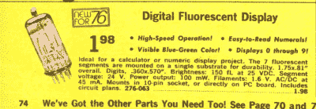
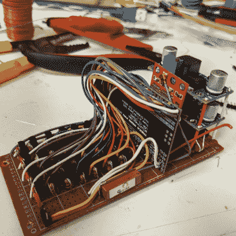

# 迷人的时钟展示濒临灭绝的展品

> 原文：<https://hackaday.com/2021/09/24/captivating-clock-puts-endangered-displays-on-display/>

The DT-1704 VFD as seen the 1976 Radio Shack Catalog. The “A” version has no substrate, making the VFD fully clear for added effect.

当你有一个 1976 年 Radio Shack 目录上的真空荧光显示器(VFD)的小库存时，你可能会无所事事，不知道该拿它们怎么办。当[stepawayfromthegirls]发现他藏匿的 7 支 DT-1704A 管可能是现存的最后一支时，毫无疑问。必须展示出来！[stepawayfromthegirls]的展示方式是[这座迷人的时钟建筑](https://www.reddit.com/r/DIY/comments/psi6s2/i_made_a_vacuum_fluorescent_display_clock_from/)。四个带有浅绿色元素的 VFD 在定制的木箱中以黑色为背景。往引擎盖下看，美只会增加。

VFD Clock Wiring is nearly as stunning as the clock itself.

保持建筑的有序不是一件容易的事情，因为地铁的设计要求每个部分都必须单独控制。所需的 I/O 任务由 Arduino Mega 2560 Pro(嵌入式)提供。28 个 2n3904 及其两个电阻用作每个 VFD 段的驱动器。

20 世纪 80 年代遗留下来的 24 V 交流变压器的输出被整流为 34 V 的 DC 电源，然后被调节为 27 V 以给电子管供电。开关电源为 Arduino 提供 6 V 电压，为灯丝提供 1.3 V 电压。如果你仔细看，你还会看到一个 GPS 模块，这样就不需要设置时钟了。为了防止时钟受到夏令时调整的影响，表壳背面的电位计允许用户设置自定义小时偏移，而无需编辑任何代码。

我们认为最终的结果是一个非常干净，简单，优雅的时钟，他将在未来的许多年里感到自豪！

如果 VFD 时钟构建是你的事情，那么你会喜欢这个[网络连接 VFD 时钟](https://hackaday.com/2020/02/06/a-network-attached-vfd-tube-clock/)和一个带浮动显示的[迷你 VFD 时钟](https://hackaday.com/2019/09/26/mini-vfd-clock-floats-the-display-above-it-all/)。虽然不是基于 VFD 的，但我们会很傻地忽略掉[船锚谢妮时钟](https://hackaday.com/2021/04/27/boat-anchor-nixie-clock-plays-the-cold-warrior-role-convincingly/)，它有足够的旋钮、开关和按钮来取悦即使是最挑剔的黑客。