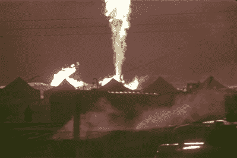
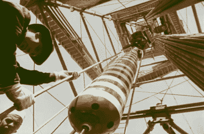

# 是的，你可以用核弹扑灭一口燃烧的气井

> 原文：<https://hackaday.com/2021/10/05/yes-you-can-put-out-a-burning-gas-well-with-a-nuclear-bomb/>

核爆炸最初是作为战争武器在第二次世界大战的激烈环境中发展起来的。然而，战争结束后，人们开始考虑这项新的强大技术的其他用途。科学家和工程师们都梦想着用原子能的强大力量挖掘新的运河或将人类送上太空的宏伟计划。

这些很少成为现实，辐射问题是最常见的原因。然而，苏联事实上成功地将核爆炸很好地用于民用目的。最早的例子之一是在 20 世纪 60 年代中期用核弹堵住一口失控的天然气井。

## 传统的方法试图

The towering flame reached as high as 120 meters into the sky.

1963 年 12 月 1 日，Urta-Bulak 气田的 11 号井因违反适当的钻井程序而发生井喷。这个 2409 米深的洞打开了一个压力为 300 大气压的地下气藏。井喷造成了巨大的破坏，气体很快在表面着火，延伸到 120 米的天空。拖拉机被用来清理现场，但火焰每天继续燃烧 1200 万立方米的天然气。

情况从一开始就很困难。最初的尝试是用水来冷却该区域并减小火焰的大小，这样就可以安装分流器来改变气体的方向并安全地将其烧掉。

然而，11 号井并没有不战而降，新分流帽带来的压力限制只是导致气体渗透到原井眼周围的其他地下层。这种气体含有很高的硫化氢，随着有毒气体从地下冒出，陨石坑开始在地表形成。这种情况太危险了，不能再继续下去了，所以分流器很快就被拆除了。

又花了两年时间试图用传统方法阻止气体的流动。钻了多口减压井，试图将流体泵入气体地层以阻止流动。然而，问题是原来的 11 号井已经偏离垂直钻井，在 2400-2600 米深度偏离目标 120 米。因此，钻一个减压孔是很困难的，因为工作人员不知道他们真正应该钻哪里才能进入储层。

## 去他的，是时候发射核武器了

 [https://www.youtube.com/embed/2KJ6p4JVN4g?version=3&rel=1&showsearch=0&showinfo=1&iv_load_policy=1&fs=1&hl=en-US&autohide=2&wmode=transparent](https://www.youtube.com/embed/2KJ6p4JVN4g?version=3&rel=1&showsearch=0&showinfo=1&iv_load_policy=1&fs=1&hl=en-US&autohide=2&wmode=transparent)

1966 年夏天，一个新的计划结出了果实，催生了一部电影，这部电影沿着实验的轨迹发展。苏联政府最近制定了一项计划，以核爆炸促进国民经济为名，探索将核爆炸用于和平目的。目的是探索各种各样的方法，使强大的核爆炸能够帮助实现工业和其他领域的和平目标。

The basic concept at play: the shockwave from the nearby nuclear blast underground seals the well shut.

随着新项目的启动和运行，领导人被问到是否可以用核爆炸来完成关闭 Urta-Bulak 气田 11 号井的任务。人们希望在地下靠近油井的地方进行核爆炸，可以把这个洞挤得更小。该计划要求一个 30 千吨的核装置在原始井眼大约 25-50 米的范围内引爆。地质分析表明，油井应该被夹在地下大约 1500 米处。这个深度的特点是上面厚厚的粘土层下的砂岩沉积物，粘土可能被认为不具有足够的渗透性来密封油井。

为了完成任务，必须确定油井的实际路径，最终发现该路径位于 1500 米深度的预定垂直路径东北 50-60 米处。随着油井位置的确定，一口压井井被小心地钻了出来，这样就可以将核装置放置在一个合适的位置。

大量的设备被运到现场来处理这项任务。放射性和地震监测器都已准备就绪，准备进行这一史无前例的实验。现场建立了一个指挥站，以便引爆核装置，这是阿尔扎马斯核武器实验室为此目的专门建造的。核爆炸被小心地降低到适当的位置，然后压井被封固，以避免留下气体泄漏到地下其他地质层的次要路径。

The 30 kiloton nuclear device being carefully lowered into the killing well. Note the striking paint scheme.

该装置于 1966 年 9 月 30 日上午被引爆，此时油井已经泄漏了整整 2 年零 9 个月的天然气。为安全起见，方圆 5 公里的爆炸范围已被清理，所有人员和车辆都已撤离该区域。爆炸出乎意料地平淡无奇，地面有轻微的移动，听到并感觉到隆隆声，但仅此而已。气体耀斑立即开始收缩，爆炸后仅 23 秒就熄灭了。

不久后，放射安全飞机飞越了世贸中心遗址，报告称没有高于背景的大辐射，也没有甲烷的痕迹。地面辐射也在正常范围内。总的来说，实验成功了，很快结束了这个迄今为止难以解决的问题。从那里开始，封堵油井上部的简单工作就结束了乌尔塔布拉克气田漫长而艰难的一章。

## 再来四次

封闭油井避免了数十亿立方米的天然气被浪费，实验被认为是一个巨大的成功。正如 1996 年美国政府的一份内容广泛的报告中所探讨的，苏联人继续使用相同的概念总共超过四次。从 1968 年到 1972 年，帕慕克、梅斯基和克雷斯蒂什切气田的油井都成功地用核装置封堵了。最后一次尝试是在 1981 年，在俄罗斯北部海岸的 Kumzhinsky 气田。详细情况很少，但爆炸未能密封油井，可能是由于对要密封的目标位置的信息不清楚。

自那以后，将核爆炸用于和平目的的概念已经基本失宠。对放射性污染、核扩散以及核装置的潜在盗窃和错误使用的担忧都被列为反对使用的理由。在 80 年代末和 90 年代初暂停核试验后，苏联的核计划也终止了。然而，正如苏联在 20 世纪中期巧妙地证明的那样，核爆炸可以封闭一口被炸坏的气井。仅凭这些优点，它就完成了任务！