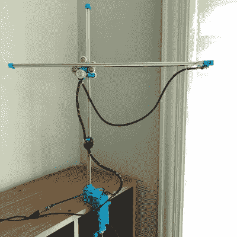

# 黑客日奖机器人的最后一个周末

> 原文：<https://hackaday.com/2021/09/24/final-weekend-of-robots-in-the-hackaday-prize/>

这是最后一个周末[参加 2021 年 Hackaday 奖](https://prize.supplyframe.com/#section-challenges)的机器人项目。

“重新定义机器人”挑战赛期待你提出让机器人成为现代生活一部分的好主意。长久以来，人们一直在憧憬这些机器的未来。但是他们现在应该是什么样子呢？当然，这可能是 C-3PO，但更有可能的是，你的机器人助手靠智能手表生活，或者当有限的移动性对某人构成挑战时，省力的 droid 通过传递黄油来提供帮助。哪里的日常用品会因为一点巧妙的技术而变得更好？

This [robot holds the flashlight](https://hackaday.io/project/173712-3d-printed-hand-following-ai-task-light) , following your hands as you work.

这里的部分挑战是打破几十年来形成的看机器人的模式，这种模式往往只有几种形式；有四个轮子和一个摄像头的东西或者设计来模仿人体的机器人。反思这些刻板印象的一个很好的例子是[【哈里·高的】任务照明机器人](https://hackaday.io/project/173712-3d-printed-hand-following-ai-task-light)。它使用机器学习来寻找你在工作表面上的手，并移动一盏明亮的灯，以确保你总能看到你在做什么。

当然，运动不是先决条件，如果你想把这看作一个智能自动化的挑战。科幻小说中最好的机器人被人们记住是因为它们与人的互动——有个性的机器。在我们的世界里，陪伴你的机器人肯定有一席之地，比如这个叫做 Stack-chan 的词条。它不是人类互动的替代品，而是我们相互交流以及与周围世界交流方式的补充。

如果你让这个周末成为你自己的个人黑客马拉松，你仍然有时间参加这一轮。将选出 10 名参赛者获得 500 美元的奖金，并在 10 月底进入决赛。下周，我们将开始最后一轮外卡比赛，最终将颁发 25，000 美元的最高奖金！

[hack adayprize 2021](https://prize.supplyframe.com)主办单位: