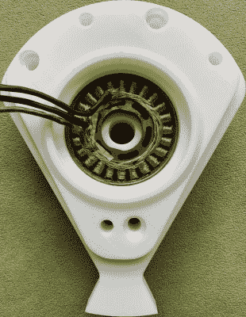

# 为什么要制造会走路的战斗机器人？

> 原文：<https://hackaday.com/2021/10/01/why-make-a-combat-robot-that-walks/>

如果你在电视上看或者在 YouTube 上看片段，你会注意到大多数战斗机器人都有轮子，这就说得通了。它们很简单，运行良好，如果设计正确，它们可以承受一点打击。那么，为什么[卢克]设计他的 12 磅重的机器人没有轮子，或者任何运动系统呢？你可以在他的有超过 130 张图片的[构建报告中找到更多关于这个奇特的机器人的信息。](https://imgur.com/a/UWdv3BU)

[卢克的]机器人，称为小猫手套，是一个陀螺步行战斗机器人。这意味着[卢克]不是通过传统的坦克履带或车轮来移动，而是通过调整他的机器人武器的角度并利用角动量抬起机器人的一侧来向前“行走”。休息后观看视频，了解实际情况。虽然这确实让 Kitten Mittens 比竞争对手慢得多，也不灵活，但它给了一个巨大的优势；体重。小猫米滕斯在 12 磅的战斗机器人重量级中战斗，但大多数联盟都为没有轮子或使用其他非传统移动方式的机器人提供重量奖励。在[卢克]参加的地方，诺沃克浩劫机器人联盟，这意味着他的机器人可以比其他竞争对手重 6 磅！

A printed prototype of the weapon, showing off the integrated hub motor.

那么[卢克]是如何利用这额外的 6 磅呢？最重要的是武器。它由 3/4 英寸 S7 工具钢制成，中心集成了一个定制的轮毂电机，使其旋转重量达到 5.5 磅。除了厚度之外，增加的重量允许更大的旋转直径，这样小猫拳击手套可以在对手攻击他之前攻击他们。

[卢克]对战斗机器人的世界并不陌生，我知道要想获胜，不仅仅需要一件大武器。额外重量预算的一部分也被用来加强他的盔甲和机器人的内部结构，这样对手的打击只会让他在笼子周围无害地弹跳。这甚至包括围绕武器的定制弯曲钛防护，以帮助自我扶正。

当它在 2021 年 2 月首次亮相时，Kitten Mittens 获得了巨大的成功！它在 NHRL 的 12 磅级比赛中以 4 比 0 获胜，赢得了 1000 美元的奖金，并获得了年度决赛的席位，在那里[卢克]将与本赛季剩余时间的其他决赛选手竞争，有机会赢得 12000 美元的冠军奖金。

最近，在所有重量级中，行走、拖拖拉拉或爬行的机器人越来越成为一种趋势。就连 250 磅重的机器人“大修”也有了一双新脚，可以拖着脚到处走。你可以在这里阅读更多关于这个有趣概念的内容。

 [https://www.youtube.com/embed/pf_QSfHSrRg?version=3&rel=1&showsearch=0&showinfo=1&iv_load_policy=1&fs=1&hl=en-US&autohide=2&wmode=transparent](https://www.youtube.com/embed/pf_QSfHSrRg?version=3&rel=1&showsearch=0&showinfo=1&iv_load_policy=1&fs=1&hl=en-US&autohide=2&wmode=transparent)

