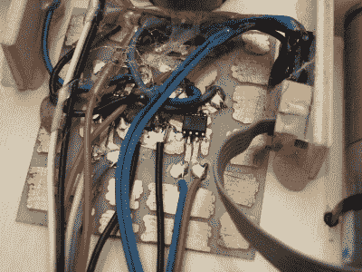

# 拥抱新的，但不要忘记旧的

> 原文：<https://hackaday.com/2021/09/25/embrace-the-new-but-dont-forget-the-old/>

我们在秘密的地下黑客掩体中交流我们第一批自制 PCB 的故事，有几块电路板看起来真的很不错。当然会有错误和次优路由，但是我们当中有谁从来没有连接错误的信号或使用错误的足迹呢？让我有一个黑客“这些天的孩子有它这么容易”的时刻的是，所有的板，当然，专业制造的漂亮丝网印刷。他们都*看起来棒极了*。

开始硬件之路是多么美好的时光啊！当我制作我的第一个 PCB 时，选择基本上是放下胶带，拔出防蚀笔，或者为快速原型板支付数十亿美元的通货膨胀调整费用。这意味着有抱负的黑客也必须有一双稳定的手，至少偶尔熟悉一点化学。将你的文件发送到印刷电路板的能力意味着从插件模块升级你的硬件游戏的障碍比以往任何时候都要低。

但是，如果从铜板上刮擦或蚀刻出你自己的 PCB 是非常手工的，非常 DIY 的，非常低技术含量的，那么与最匆忙的服务相比，这也是非常快的。上周末，我需要一个分线板，用于一些八引脚 SOIC H 桥芯片，以配合我儿子的海龟机器人项目。周六下午和晚上，所有东西都是手工焊接和热粘合的，所以没有时间订购 PCB。对老方法来说是一个绝佳的机会。

 我们拿出一支记号笔，画出 SOIC 引脚的落点，连接地线，将信号传送到友好的焊盘，然后将电路板的其余部分覆盖在铜岛上，以防我们以后需要任何原型制作空间。当然，一些墨线在不应该接触的地方相互接触，但是在铜遇到腐蚀剂之前，用大头针把空隙刮干净是很容易的。结果呢？我的板子看起来像是被穴居人凿出来的，但它们确实有效。更重要的是，我们在没有启动电脑的情况下，在二年级学生的注意力范围内完成了这项工作。

所以陶醉在你的廉价离岸 PCB 工厂，今天的黑客！即使是四层板也能在一周内回来而不倾家荡产，真是奇迹。但是我鼓励大家也用手来尝试一下。对于足够大的包和一次性的，全 DIY 绝对有速度优势，但也有一定的 [*【瓦比萨比】*](https://en.wikipedia.org/wiki/Wabi-sabi) 到手绘板。像残铜中的笔触。

This article is part of the Hackaday.com newsletter, delivered every seven days for each of the last 200+ weeks. It also includes our favorite articles from the last seven days that you can see on [the web version of the newsletter](https://mailchi.mp/hackaday.com/hackaday-newsletter-649368). Want this type of article to hit your inbox every Friday morning? [You should sign up](http://eepurl.com/gTMxQf)!