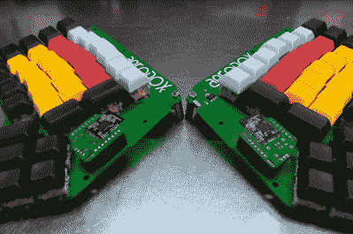
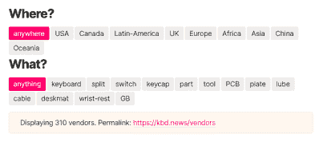
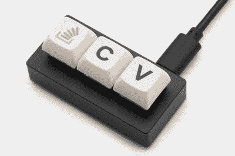
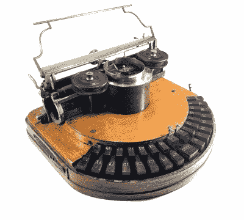

# 和克里斯蒂娜一起“基宾”:有弯曲打字机的那个

> 原文：<https://hackaday.com/2021/10/13/keebin-with-kristina-the-one-with-the-curved-typewriter/>

## aerovox 在无线翅膀上飞行

 【西蒙·梅里特】在开始这个项目时，他对键盘一无所知，但他并没有因此而止步。[西蒙]做了我们任何人都会做的事情——找出你喜欢的东西，学到足够危险的东西，然后开始四处游荡，汲取所有的灵感，把[各种影响融合在一起，满足你的需求](https://hackaday.io/project/171535-aerodox)。

Aerodox 的设计融合了 [ErgoDox](https://www.ergodox.io/) 的按键布局和氧化还原无线的逻辑和通信，而氧化还原无线本身就是 ErgoDox 的缩小版。有趣的是，[Simon]选择的是 ErgoDox 的尺寸和间距，而不是氧化还原的尺寸和间距。像那里的许多人一样，[我发现 ErgoDox 对我的手来说太大了](https://hackaday.com/2020/06/02/inputs-of-interest-ergodox-post-mortem/)，主要是因为拇指簇离大陆太远了。不过，很高兴看到它适合某些人。

[Simon]开发了一种定制的热插拔足迹，使电路板可以反转，就像 ErgoDox 一样。每一半都有一个 NRF51822 作为大脑，还有第三个作为接收器。这个外部 NRF 板通过 UART 连接到 Arduino Pro Micro，Arduino Pro Micro 充当 USB HID 并运行 QMK。这肯定是一次有趣的旅程，所以[去挖掘日志](https://hackaday.io/project/171535/logs)。

## 一切键盘供应商数据库

Image via [Keyboard Builders’ Digest](https://kbd.news/vendors)

你是否渴望找到几年前买的那个 one group 的 60%键盘，但它们在 r/mechmarket 上总是走得太快？或者那个停产的桌垫，或者完美的开关拔出器呢？

键盘或键盘配件，无论您在寻找什么，它可能会从全球 300 多家供应商中的一家获得，这些供应商目前都列在[键盘构建者摘要的供应商数据库](https://kbd.news/vendors)中。

也许你花了 2020 年的大部分时间来定制电缆，你想清理一些堆积在你办公桌周围的库存。无论你的商店是大是小，你都可以免费进入这个数据库。而且，很快—您的供应商档案越完整，您的供应商得分(满分 10 分)就越高。这些都在常见问题解答中。

## 堆栈溢出宏 pad 现在是一个真实的东西

Image via [Drop](https://drop.com/buy/stack-overflow-the-key-macropad)

还记得 Stack Overflow 的这个愚人节恶作剧吗？内容霸主本·波普(Ben Popper)告诉用户，他们将不再能够从网站[复制和粘贴代码，除非他们购买了密钥](https://stackoverflow.blog/2021/03/31/the-key-copy-paste/)——一个微小的专用宏盘，用于解锁单空间商品。

当足够多的人想要你的假货，你还不如想办法生产。Stack Overflow 与 Drop 和键盘鉴赏家[卡西迪·威廉姆斯]合作实现了这一目标。根据博客上的更新，这些产品的原始生产线在六个小时内售罄。

只有 29 美元，每笔销售收入的一部分将捐给 digitalundivided，这是一家帮助黑人和拉丁裔女性在科技领域成功创业的非营利组织。我们喜欢愚人节玩笑成真的时候，尤其是它们还能带来一些好处的时候。

## 历史克拉克斯:哈蒙德 1 打字机

Image via [the Antikey Chop](https://www.antikeychop.com/hammondno1typewriter)

尽管琴键类似于钢琴的布局，但这与制造风琴的公司不是同一个哈蒙德。这款 [Hammond 是继 Remington 和 Caligraph](https://www.typewritermuseum.org/collection/brands/index.php3?machine=hammond1&cat=ks) 之后上市的第三款打字机，尽管它可能是第一款，如果不是因为一些挫折而推迟到 1884 年才上市的话。

这台打字机不仅引人注目，而且有几个特点使它从 QWERTY 打字机中脱颖而出。最明显的就是实心乌木键的弧形键盘。代替打字杆，Hammond I 有一个由两个弯曲部分组成的[型梭子](http://hammondtypewriter.com/shuttles/)，键盘的每一半各有一个。梭子可以很容易地换成另一种字体、字体大小或语言，这为[的盲文梭子](http://hammondtypewriter.com/hammond-for-the-blind/)和大量哈蒙德打字机分发给盲人学校的贫困儿童铺平了道路。

不太明显的是事情的实际运作方式。当一个键被敲击时，打字梭会来回摆动以显示正确的字母。一个装有弹簧的锤子从后面敲打纸张，将它推向梭子。无论打字员如何用力或轻柔地挠电子书，锤子都能确保每个字母的力度一致，这让哈蒙德在纸张上打印清晰的印象时拥有优势。

大约直到 1920 年，哈蒙德打字机才被制造出来。最初的哈蒙德一世是橡木、桃花心木或樱桃木的，钥匙只有实心乌木的。它卖 100 美元，这在当时比一辆马车还贵。你会花更多的钱在键盘上而不是汽车上吗？

## 历史奖励:这个旧开关

我从易趣上的一个小贩那里买了一对这种老式樱桃，他有一堆松散的开关出售。据说它们是第一批机械键盘开关，如果不是第一批的话。

虽然除了 Cherry 和开关上的电气额定值之外没有其他标识符，但这些被广泛称为 1959 年的 01APBSW [型，尽管](https://patents.google.com/patent/US3056002)[它们可能是 S-31s](https://telcontar.net/KBK/Cherry/S31) 的某种形式。关于 desk authority 还有更多信息[，包括一张充满类似开关的计算机通信 303 键盘的侧视图。](https://deskthority.net/viewtopic.php?t=11362)

我真的很喜欢这些开关。首先，它们看起来像小莫尔斯键盘或小捕鼠器。它们的手感也很好——线性运动，启动时有一点点触感。我想用它们做一个完整的键盘，或者至少用它们中的一个来代替我新买的三脚踏板中现在无声的开关。

我的两个开关听起来略有不同。下面是一个低音开关的例子。在我看来，这听起来更好。我的麦克风听不到这些音调，但它们有一个音乐盒在闪烁。[这个视频很好地捕捉了声音](https://www.youtube.com/watch?v=VvTSLRab7Kg)。

<https://hackaday.com/wp-content/uploads/2021/10/1959-Cherry-switch.mp3?_=1>

[https://hackaday.com/wp-content/uploads/2021/10/1959-Cherry-switch.mp3](https://hackaday.com/wp-content/uploads/2021/10/1959-Cherry-switch.mp3)

## ICYMI: r0tring CS-50 修复

如果你曾经不得不在技术图纸上书写任何 ISO 字母，你就会知道无论是使用模板还是徒手绘制都是多么乏味。然而，还有另一种方法，它被称为划线器。

基本上，你在键盘上打字，在屏幕上确认输入，然后它用支架上的细绘图笔为你写下字母。这是一个便携式书法绘图仪，通过更换其中一个电机驱动芯片，[Atkelar] [将它从死亡边缘](https://hackaday.com/2021/09/29/plotting-to-restore-a-r0tring-cs-50/)拉了回来。一定要[看看视频](https://www.youtube.com/watch?v=rz_wnqaPhrs)看看【Atkelar】是如何使用粘合剂和普通家居用品重建一个破损的螺丝头的。

* * *

有关于键盘的热门提示吗？通过发送一两个链接来帮助我。不想让所有的黑客抄写员看到它？欢迎[直接给我发邮件](mailto:kristinapanos@hackaday.com?Subject=[Keebin' Fodder])。