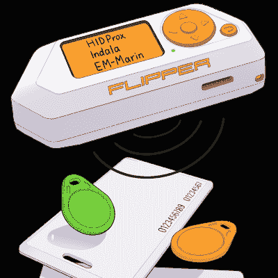

# 你的银行卡上有什么？黑客工具教授所有关于 NFC 和 RFID 的知识

> 原文：<https://hackaday.com/2021/10/04/whats-on-your-bank-card-hacker-tool-teaches-all-about-nfc-and-rfid/>

Flipper Zero 是一款多功能黑客工具，旨在通过流畅的设计、广泛的功能和梦幻般的用户界面，让硬件黑客世界变得更容易访问。他们现在像其他人一样在与制造延迟作斗争，但也有一线希望:团队的更新确实是信息丰富和深入的。[最新更新是关于 RFID 和 NFC](https://blog.flipperzero.one/rfid/) ，以及 Flipper Zero 如何与各种非接触式协议进行交互。

Popular 125 kHz protocols: EM-Marin, HID Prox II, and Indala

非接触式标签大致分为低频(125 kHz)和高频标签(13.56 MHz)，仅仅通过外表是不可能识别哪个是哪个的。Flipper Zero 可以与两者接口，但上面链接的更新详细介绍了这些标签在现实世界中的使用情况，以及它们从外部和内部看起来的样子。

例如，125 kHz 标签的天线由多圈非常细的导线制成，线圈之间没有可见的空间。另一方面，高频标签的天线线圈更少，天线之间的空间也更大。为了区分它们，明亮的光线往往足以透过薄塑料看到天线结构。

低频标签是“哑的”，无法加密或双向通信，但像银行卡和 Apple Pay 这样的应用程序的高频(通常指 NFC)呢？有一点可以证明，与实体银行或信用卡相比，移动支付方式提供的按需信息要少得多。使用物理非接触式卡，可以读取完整的卡号、有效期，在某些情况下还可以读取姓名以及最近的交易。移动支付系统(如苹果或谷歌支付)不会这样做。

像许多其他人一样，我们期待着它的上市，遗憾的是，组件短缺似乎正在影响每个人，这是无法回避的。