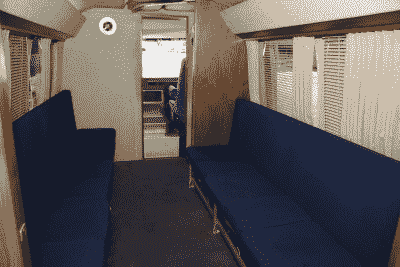
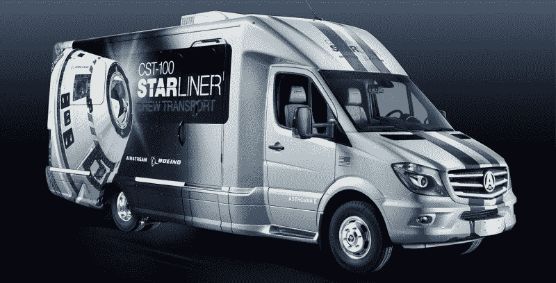

# 美国宇航局正在寻找下一代宇航员面包车

> 原文：<https://hackaday.com/2021/09/28/nasa-is-looking-for-a-next-gen-astronaut-van/>

自从阿波罗计划以来，宇航员从操作和检验大楼到发射台的九英里旅程都乘坐一辆专门的货车，这种货车被亲切地称为 *Astrovan。最初的面包车，技术上说是一辆改装的房车，从 1967 年一直使用到 1983 年的第一次航天飞机任务。从那时起，一架印有美国国家航空航天局“肉丸”的银色气流 Excella 运载着宇航员，直到最后一架航天飞机在 2011 年停下来。*

随着阿耳忒弥斯月球计划的载人飞行即将到来，美国国家航空航天局(NASA)已经向那些想要建造新的载人运输工具(CTV)的公司发出呼吁。正如你可能从火箭科学家那里期待的那样，航天局为新 CTV 提供了一份严格的规格清单，小到门的尺寸，大到每个 12 伏直流电源插孔必须能够承受多少安培。也许最值得注意的是，美国国家航空航天局要求新的 8 座*太空车*是零排放车辆；考虑到它相对较短的行驶距离，应该不会太难。

Interior of the Shuttle-era *Astrovan*

在该文件中，美国宇航局解释说，新的 CTV 可能是一种全新的独一无二的车辆，或者是经过适当修改的商用车辆，就像以前的面包车一样。但有趣的是，它还表示，他们对翻新航天飞机时代的 1983 年气流并将其投入使用的建议持开放态度。

这尤其令人惊讶，因为该飞行器目前是肯尼迪航天中心的 [*亚特兰蒂斯*展览的一部分。据推测，航天局认为，如果阿耳忒弥斯机组人员乘坐曾经运载过航天飞机宇航员的同一辆面包车前往发射台，会有一些值得留恋的东西，但鉴于该车的历史以及它实际上是一件博物馆藏品的事实，这似乎有点不合适。毕竟，这辆货车曾经载着*号挑战者*和*号哥伦比亚*号机组人员前往他们命运多舛的宇宙飞船。幸运的是，任何人想把 1983 年的 Airstream 变成零排放汽车的可能性似乎都很小。](https://hackaday.com/2019/06/18/an-evening-with-space-shuttle-atlantis/)

如果你想知道，SpaceX 用特别改装的特斯拉 Model X 豪华 SUV 载着宇航员前往发射台，波音公司已经与 Airstream 合作建造他们自己的 *Astrovan II* 。波音公司何时[真正把他们的 CST-100 Starliner 送上国际空间站](https://hackaday.com/2019/12/20/boeings-starliner-fails-to-reach-space-station/)还没有日期，但至少货车已经准备好了。

