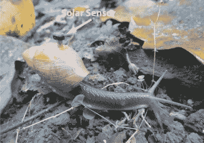
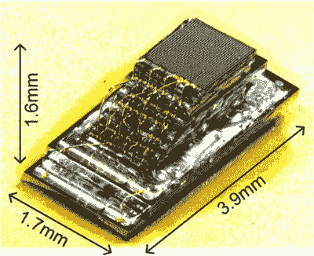
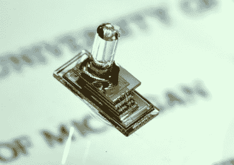
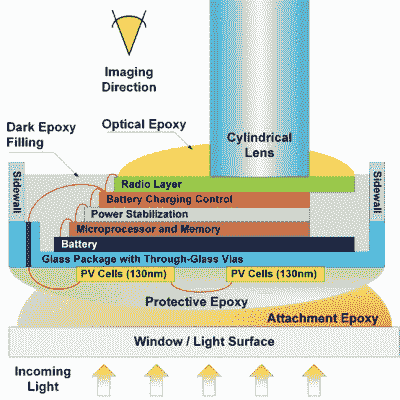
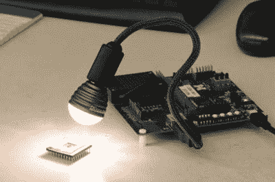

# 蜗牛、传感器和智能灰尘:密歇根微尘

> 原文：<https://hackaday.com/2021/10/04/snails-sensors-and-smart-dust-the-michigan-micro-mote/>

如果你想追踪一只蜗牛，你需要一个微型仪器包。如何创建一个完整的数据采集系统，包括传感器、内存、数据处理和电源，小到足以装进蜗牛壳？

纵观历史，人类通过引入入侵物种扰乱了世界各地的许多生态系统。澳大利亚的兔子是一个著名的例子，但也许不太为人所知的是巨大的非洲陆地蜗牛( *Lissachatina fulica* )，它们在 20 世纪中期被引入南太平洋岛屿。原本打算作为食物来源(*蜗牛非洲*，有人吗？)，它们很快变成可怕的害虫，吞噬当地的植物和农作物。

生物学家没有被吓住，他们引入了另一种蜗牛，希望能杀死非洲的蜗牛:玫瑰色的 wolf snail(*Euglandina rosea*)，原产于美国东南部。然而，这种食肉蜗牛对非洲入侵者并没有表现出很大的兴趣，相反，它继续大量减少本地蜗牛的数量，导致数十种本地物种灭绝。

A Rosy Wolfsnail carrying a light sensing Micro Mote on its back. Source: Cindy S. Bick et al., 2021

一只名为 *Partula hyalina* 的白色小蜗牛在这场大屠杀中幸存了下来。局限在塔希提岛热带森林的边缘，生物学家推测它能够通过隐藏在阳光充足的地方来躲避捕食者，这些地方对 T2 玫瑰来说太亮了。据推测， *P. hyalina* 的乳白色外壳通过比狼蜗牛的橙棕色外壳反射更多的阳光来保护它们免受过热。

这听起来很合理，但生物学家需要证据。因此，来自密歇根大学的一个团队建立了一个实验来测量这两种蜗牛所经历的太阳辐射量。他们将微小的光传感器附着在狼蛛的壳上，然后再次释放它们。传感器测量动物看到的阳光量，并记录一整天的信息。然后再次捕捉蜗牛并检索数据，结果证明了最初的假设。

科学就这么多，但是他们到底是怎么做到的呢？

## 密歇根微尘(M3)

由大卫·布劳领导的密歇根大学低功耗电路研究小组开发了一种超小型化计算机，他们称之为[密歇根微尘](https://ece.engin.umich.edu/stories/michigan-micro-mote-m3-makes-history-as-the-worlds-smallest-computer/)。术语“微尘”是指可以测量一些量并将其发现报告给更大的计算机系统的无线传感器节点。像这样的微小尘埃有时被称为“智能尘埃”，这个术语在 21 世纪初有一些炒作，但谢天谢地还没有达到一些[更具启示性的愿景](https://www.michaelcrichton.com/prey/)。

A Micro Mote with a temperature sensor. Source: Cindy S. Bick et al., 2021

比一粒米大不了多少的 M3 被称为世界上最小的计算机。尺寸约为 2 毫米 x 2 毫米 x 3 毫米，由几个裸芯片堆叠而成。它们共同构成了一个完整的无线传感器节点。由电池和太阳能电池供电，他们可以测量一些东西，将结果存储在 RAM 中，并使用无线通信链路发送结果。

连接这些元件的设计的共同主线是低功耗。所谓低，我们指的是非常低:有功功率是微瓦或纳瓦级，而待机功率是皮瓦级。这种极低的功耗是必需的，因为在有限的可用体积中只能产生和存储非常少的功率。

## 传感器

尘粒的顶层是传感器。Micro Mote 团队开发了温度和压力传感器以及图像传感器。温度传感器是一个[超低功耗传感器](http://ieeexplore.ieee.org/xpl/articleDetails.jsp?arnumber=6835198)，可以测量 0 到 100°C 之间的温度，精度约为 1.5°C，仅使用 71 nW。[压力传感器](http://ieeexplore.ieee.org/xpl/abstractAuthors.jsp?arnumber=5746332&tag=1)是一种 MEMS 装置，用于测量人体内部的压力。这种测量可用于诊断青光眼(当植入眼睛中时)或跟踪植入肿瘤中的化疗效果。

A Micro Mote with an image sensor. Credit: Electrical & Computer Engineering at the University of Michigan, Ann Arbor

至于[图像传感器](http://ieeexplore.ieee.org/xpls/abs_all.jsp?arnumber=6858425)，那些寻找全动态高清视频的人会失望:一个 160 x 160 像素的单色传感器是所有适合体积和功率限制的。一个[梯度指数](https://en.wikipedia.org/wiki/Gradient-index_optics)棒形透镜安装在传感器的顶部以聚焦图像。该传感器可以在低功耗模式下工作，通过扫描非常低分辨率的图像来执行运动检测，仅在有显著运动时拍摄全分辨率照片。

蜗牛研究实际上使用了带有温度传感器的微粒，并巧妙地使用了太阳能电池，如下所述，用于光传感和发电，消除了对耗电专用光传感器的需要。

## 数据处理

A diagram showing the components of the imaging Micro Mote. Source: Gyouho Kim et al., 2014

微尘运行的核心是由一对微处理器构成的。两者都是 ARM Cortex-m0，但都采用不同的制造工艺，要么提供高性能，要么功耗极低。处理来自图像传感器的数据等任务需要高速 CPU，而低功耗 CPU 则负责一般的日常工作，如协调不同芯片之间的数据流。

CPU 和系统其余部分之间的接口自然也必须是超低功耗的。像 SPI 和 I ² C 这样的标准总线太耗电了；研究小组因此开发了一种新的巴士，命名为 [MBus](http://mbus.io/) 。面向集成纳米系统，它能够与处于睡眠模式或完全断电的子系统一起工作。

## 通信

这种微尘的微小尺寸意味着没有连接器来获取数据，所以所有的通信都必须通过无线方式进行。为此，有两种接口可供使用:一种用于系统编程的光路，一种用于输出数据的无线电链路。

Programming the Mote with light. Note how this Mote was packaged in a standard IC package for testing. Credit: Electrical & Computer Engineering at the University of Michigan, Ann Arbor

[光路](https://ieeexplore.ieee.org/document/6330603)使用光电二极管，这些光电二极管被策略性地放置在焊盘附近，因此它们暴露在环境光下。通过以特定的模式向它们闪烁，CPU 进入编程模式，使用户能够写入主代码存储器。

传感器数据可以用低功率无线电再次读出:用户将接收器放在尘粒附近，读出存储在存储器中的任何数据。在 915 MHz ISM 波段发射，无线电的范围约为两米，尽管布劳博士说计划将范围增加到 20 米。这个较大的范围也可以让多颗尘粒互相沟通，这样就能形成完整的独立感测网路。然而，有限的功率预算和天线的物理约束使这成为一个真正的挑战。

## 力量

这个巨大的尘粒由锂电池供电，同样被小型化以适合芯片堆叠。它的容量是微不足道的 5.7 uAh(对于图像传感版本)或 2 uAh(对于其他两个版本)。这大约是普通智能手机电池的百万分之一大小，但仍能让尘粒工作一两天。然而，由于太阳能电池形成了电池堆的底层，这可以无限期地延长。这种电池的面积约为一平方毫米，产生的光量约为 20 毫瓦。

电源管理单元(PMU)从电池的 3.8 V 电压为各种芯片产生合适的电源电压(1.2 V 和 0.6 V)。它还管理太阳能电池的运行，跟踪其最大功率点，以提取尽可能多的能量。所有芯片还包括大量的片上去耦电容，因为微粒太小，甚至连最小的 SMD 电容都无法连接。

在塔希提蜗牛研究中，PMU 的控制信号被巧妙地用于读出入射的太阳辐射。随着光量的波动，内部电荷泵的频率也在波动，通过记录这个值，研究人员获得了对太阳辐射的准确测量，而不必添加单独的光传感器。

## 包装

如上所述，一个完整的系统是由这些部分组成的，只需将芯片以类似阶梯的方式堆叠起来，并用金线将它们连接起来，这与普通多芯片模块(MCM)的制造方式基本相同。太阳能电池板在底部，传感器位于顶部。然后将整个组件封装在环氧树脂中，在需要的地方有透明部分。

确切的包装设计取决于微尘的最终应用。对于蜗牛的研究，芯片被简单地封装在带有太阳能电池窗口的黑色环氧树脂中，然后粘在一个可以拧入蜗牛壳螺母的螺栓上。植入眼睛或肿瘤的微粒需要一个生物兼容的外壳，而那些在恶劣环境中工作的微粒可能需要一个更坚固的包装。

## 应用程序

在其开发的早期，这种微型微粒的目标是医疗应用，如测量眼睛或肿瘤内部的压力。一种类似的设计也被开发出来，可以将[注射到体内](https://ece.engin.umich.edu/stories/injectable-computers-can-broadcast-from-inside-the-body/)。自 2016 年以来，关于微尘的医疗应用发表的文章并不多，但我们认为这并不是因为缺乏机会，因为它应该会使像[智能药丸](https://hackaday.com/2015/11/30/swallow-the-doctor-the-present-and-future-of-robots-inside-us/)这样的东西的开发更加容易。

塔希提蜗牛研究是在保护工作中使用无线传感器节点的一个很好的例子。研究小组已经在进行另一项涉及帝王蝶的研究[，这项研究需要更加小型化，以使设备适合帝王蝶柔弱的身体。](https://ece.engin.umich.edu/stories/tracking-monarch-butterfly-migration-with-the-worlds-smallest-computer)

带有图像传感器的版本在安全和监控方面具有潜在的应用。一个米粒大小的无线自主相机可以很容易地隐藏在任何地方。然而，无线电的有限范围仍然排除了实际的*远程*观察。

大卫·布劳研究小组的一个分支，一家名为 [Cubeworks](https://www.cubeworks.io) 的公司，正在通过制造用于物流和制药的小型无线传感器，将这项技术商业化，例如在运输过程中记录化学品的温度。这有助于确保疫苗等高价值商品在从工厂到诊所的整个运输过程中得到妥善冷藏。

总的来说，密歇根微尘是一个很好的例子，说明了如何在极其有限的空间内，以更低的功耗构建电子系统。虽然不完全在一般爱好者的能力范围之内，但基本思想可以使用商业上可获得的组件大量复制。蜗牛可能太小了一点，不适合工作，但是我已经在想我可以在我的猫项圈上安装的所有传感器。当然，不仅仅是一台相机。

[标题图片:位于硬币边缘的密歇根微尘。鸣谢:马丁·弗洛埃特，密歇根大学]