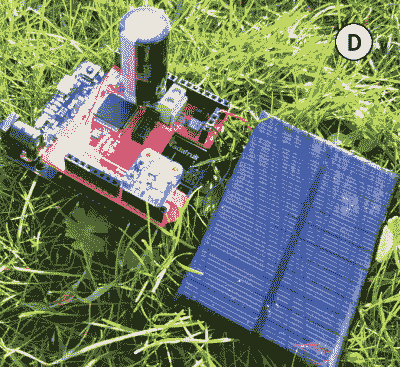

# BFree 为 Python 带来了间歇计算

> 原文：<https://hackaday.com/2021/09/29/bfree-brings-intermittent-computing-to-python/>

一般来说，我们希望我们的计算设备在我们使用它们的整个过程中保持开启和活动状态。但是也有一些情况，比如离网设备依靠小型太阳能电池运行，在这种情况下，恒定的功率绝不是一种保证。这就是间歇计算的概念发挥作用的地方，现在多亏了 BFree 项目，你可以[开发 Python 软件，即使硬件黑了](https://github.com/tudssl/bfree)。

BFree 被实现为一个屏蔽，连接到运行经过修改的 CircuitPython 解释器的 Adafruit Metro M0 Express，在用户代码运行时自动创建“检查点”,这样，如果电源意外切断，它可以立即将环境恢复到已知的良好状态。系统的快照，包括从存储在存储器中的变量到每个独立外设的状态，都存储在 BFree 板上 MSP430 微控制器的非易失性 FRAM 上；也就是说，即使电源几周或几个月没有恢复，软件也会准备好重新投入运行。

 除了系统检查点的存储，BFree 板还包括能量收集电路和太阳能电池板和大电容器的连接。值得注意的是，该系统没有提供传统电池。在开发代码时，您可以让 Metro M0 Express 保持通电，但一旦您准备好进行现场测试，shield 就会负责为系统供电，只要它积累了足够的电量。

BFree 是西北大学和代尔夫特理工大学团队合作的产物，实际上是他们去年大约这个时候开发的[无电池手持游戏](https://hackaday.com/2020/09/11/game-boy-plays-forever/)的演变。虽然该项目用于提高对间歇计算如何工作的认识，但 BFree 显然是一个更灵活的平台，更适合更广泛的实验。

我们已经看到相当多的设备[长期储存少量能量](https://hackaday.com/2021/07/14/tetris-handheld-powered-by-tritium-cell-eventually/)用于快速活动，因此我们非常有兴趣看到当这种硬件与可以暂停到需要时的软件相结合时，社区可以拿出什么。