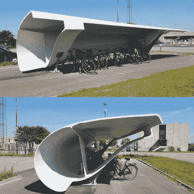
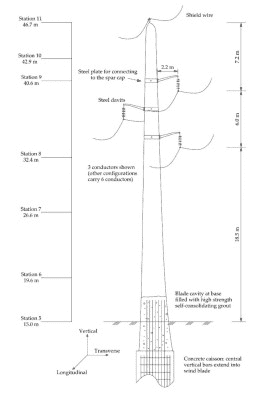
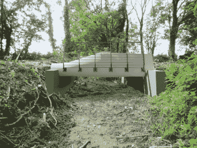

# 我们能重新利用旧的风力涡轮机叶片吗？

> 原文：<https://hackaday.com/2021/10/08/can-we-repurpose-old-wind-turbine-blades/>

风力涡轮机是一种神奇、廉价、可再生的能源。然而，没有什么是永恒的，随着时间的推移，风力涡轮机的叶片会疲劳，必须更换。这就提出了如何处理这些巨大的废刀片的问题。令人欣慰的是，各种项目正在探索这些可能性。

## 回收利用的难题

大约 85%的现代风力涡轮机是可回收的。问题是风力涡轮机叶片目前还没有。这些叶片可以使用 20 到 25 年，通常由玻璃纤维或碳纤维制成。这些复合材料由设置在树脂基质中的高强度纤维组成，难以置信地难以回收，[正如我们之前讨论过的](https://hackaday.com/2019/10/10/what-will-we-do-with-the-turbine-blades/)。与金属或塑料不同，它们不能被熔化后重新铸造成新材料。再加上风力涡轮机叶片非常巨大，通常长达 300 英尺，这个问题就变得更加困难了。它们运输困难，价格昂贵，也很难切碎。

A wind turbine blade can make for an easy-to-build bike shed, it seems. Credit: [Siemens Gamesa](https://www.facebook.com/SiemensGamesa/photos/pcb.3351248838311585/3351248684978267)

因此，Re-Wind 项目更倾向于重复利用而不是回收利用。该项目不是花费精力和时间将涡轮叶片分解成可重复使用的原材料，而是探索叶片可以被修改和重新利用的用途，同时在很大程度上保持其现有的形式。

迄今为止，已经提出了各种项目。也许最简单的是风力涡轮机制造商西门子 Gamesa 的一个项目。这家公司用一片用过的风力涡轮机叶片，在丹麦将其改造成一个时尚现代的自行车棚。

叶片经过切割和成型，以有效阻挡风雨，并能够作为一个预制构件快速安装在一对定制的金属支架上。当然，这是一种快速简单的搭建棚子或庇护所的方法，但不太可能是一种可扩展的解决方案。[正如该公司自己指出的](https://www.facebook.com/SiemensGamesa/posts/3351248838311585)，这是一个“小规模的解决方案”，但仍然很好地利用了一些废刀片。

Re-Wind 项目旨在探索更广泛的用途，BladePole 概念[是最有趣的](https://kansasreflector.com/2021/08/24/work-to-repurpose-wind-turbine-blades-spotlights-kansas-as-green-economy-leader/)之一。目的是重新使用风力涡轮机叶片作为输电杆。Re-Wind 分享的一篇主题为[的论文强调了这样一个事实，即尽管涡轮机叶片在其使用寿命期间会因疲劳载荷而损失强度和刚度，但这种损失在报废时仅为 10-20%左右。在诸如用作电线杆的应用中，动态负载将显著更小，并且总静态负载也更低。因此，在这种应用中，叶片可能具有有用的第二寿命。](https://www.re-wind.info/journal-papers/2021/8/3/aa-alshannaq-lc-bank-d-w-scott-and-r-gentry-2021-a-decommissioned-wind-blade-as-a-second-life-construction-material-for-a-transmission-pole)

A proposed design of a utility pole built out of a used wind turbine blade. Credit: [Alshannaq, Bank, Scott and Gentry, 2021](https://www.re-wind.info/journal-papers/2021/8/3/aa-alshannaq-lc-bank-d-w-scott-and-r-gentry-2021-a-decommissioned-wind-blade-as-a-second-life-construction-material-for-a-transmission-pole)

然而，也有一些警告。为了在规模上有效，并避免给公用事业工程师带来巨大的麻烦，理想情况下，以这种方式重新调整用途的叶片应该具有相同的尺寸、形状和结构。鉴于全球各地安装的风力涡轮机差异很大，情况并非如此。然而，与其说这是一个不可逾越的障碍，不如说这是复用工作的一个额外挫折。然而，如果公用事业公司发现自己使用了大量相同的涡轮机，它可以在未来重新利用自己的废物流来建设网络。这可能是一个非常简洁的解决方案。

其他概念也在开发中，例如在建筑应用中使用叶片。Re-Wind 项目已经探索了一些想法，例如使用叶片部分作为小房子的屋顶，或者作为大梁[来建造长度在 50 米以下的小桥。到目前为止，这些努力在很大程度上仍然是推测性的。](https://static1.squarespace.com/static/5b324c409772ae52fecb6698/t/60de24f395006c54a9e49f52/1625171191714/Re-Wind+BladeBridge+SuSWIND+June+17+2021.pdf)

然而，对于更严重的结构应用，面临几个问题。库尔伯格和尼格伦在 2020 年的一篇论文中指出，风力涡轮机制造商将他们叶片设计的细节作为严格保守的秘密。这阻碍了使用叶片正确设计新项目的努力，因为在没有正确了解所用材料的情况下，很难进行准确的计算。人们还担心刀片在使用过程中可能会损坏和疲劳。随着时间的推移，裂纹或其他缺陷可能会越积越多，一个用过的刀片可能不如下一个那么坚硬。因此，在设计中必须使用保守的安全系数，或者需要仔细检查叶片，以确保它们能够在结构应用中重复使用。已经暴露在 20 年的紫外线和天气下的复合材料部件的进一步退化的前景也是必须考虑的。

## 不确定的未来

A render of a proposed design of a bridge over a greenway in Cork, Ireland. The design hopes to delay the disposal of the used blade components by 60 years, but remains speculative at this stage. Credit: [Re-Wind Project](https://static1.squarespace.com/static/5b324c409772ae52fecb6698/t/60de24f395006c54a9e49f52/1625171191714/Re-Wind+BladeBridge+SuSWIND+June+17+2021.pdf)

然而，这并没有阻止所有的再利用项目，阿姆斯特丹鹿特丹的 Wikado 游乐场以充分利用旧刀片而闻名。然而，几个孩子跑来跑去与桥梁或其他结构可能看到的荷载不太一样。因此，如果使用过的涡轮机叶片要在整体上看到任何真正的结构用途，风力涡轮机制造商和工程师可能必须学会合作。

复合材料回收的问题可能已经解决，因此再利用的努力在未来风力涡轮机叶片的处理中将只起很小的作用。像西门子 Gamesa 的 RecycleBlade 这样的努力希望做到这一点，使用新的先进树脂[使原材料更容易回收。](https://www.siemensgamesa.com/-/media/siemensgamesa/downloads/en/sustainability/environment/siemens-gamesa-20210901-recycableblade-infographic-finalen.pdf)然而，就目前而言，在找到可行的前进道路之前，将继续对再循环和再利用流进行研究。与此同时，期待看到一些创造性的努力，充分利用这些巨大的复合结构！

[主图:[穆扎法尔布哈里 CC-BY-SA 2.0 公司的贾姆皮尔风电场](https://en.m.wikipedia.org/wiki/File:Jhimpir_Wind_Farm_2012.jpg)