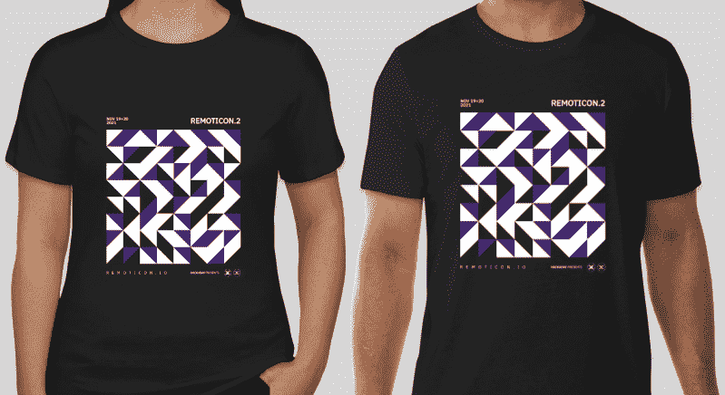
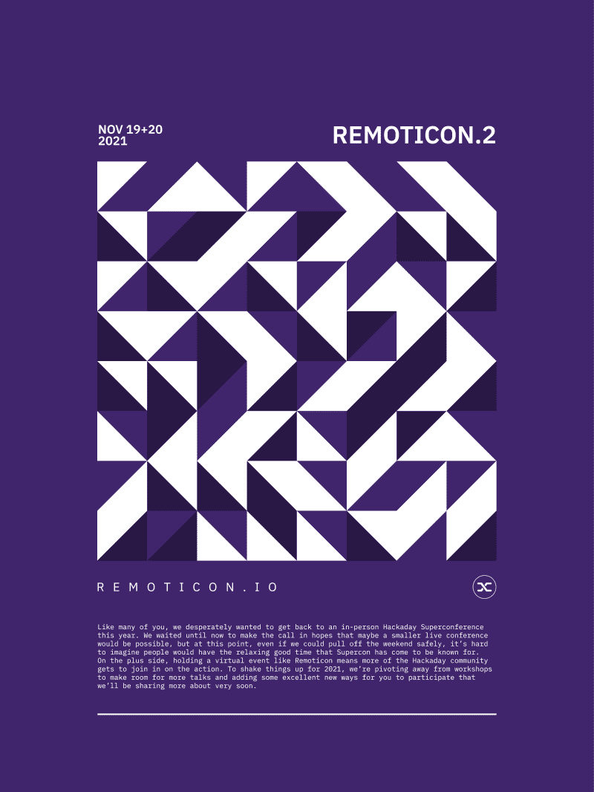

# Hackaday Remoticon:门票和 t 恤！

> 原文：<https://hackaday.com/2021/10/04/hackaday-remoticon-tickets-and-t-shirts/>

Hackaday Remoticon 的门票现已发售今年还有一个大亮点:衬衫！

毫无疑问，你已经听说了，Supercon 又要搁置一年，所以我们正在进行第二轮的 Remoticon。除了缺少与人的直接接触，我们的会议 t 恤抽屉也变得有点空了。虽然我们无法修复全球疫情，但我们可以通过这个引人注目的设计修复后一个问题，这是亚历山大·布拉迪克(Aleksandar Bradic)为黑客大会创作的一长串艺术作品中的最新作品。

Remoticon 将于 11 月 19 日星期五开播，带来一些新的社交恶作剧。周六一整天我们都将发表演讲，最后是 Hackaday 颁奖仪式和当晚的派对。留意更多信息，但是今天就拿起你的票，把你的日程表关掉。

参加是免费的，您的早期注册有助于我们规划基础设施来应对人群。如果你想要一件 t 恤衫，你可以花 25 美元同时订购一件。美国人的运费包括在内，但由于邮政成本的现实，世界其他地方的运费将为 10 美元。

**我们还在寻找更多精彩的演讲**！[的提案征集活动](https://form.jotform.com/212315522449148)一直开放到 10 月 14 日。不要袖手旁观，尽你平常的职责，谈谈你感兴趣的事情。有足够数量的其他极客也喜欢同样的东西，他们会很高兴收到你的来信！来加入我们吧。

