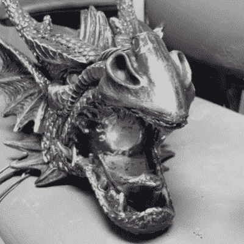

# 喷火龙头加热万圣节

> 原文：<https://hackaday.com/2021/10/04/flame-spitting-dragon-head-heats-up-halloween/>

万圣节即将来临，乔纳森·格莱希决定一个理想的中心装饰品是一个喷火的龙头。它从一个经济的壁挂式龙头开始，结合各种现成的组件，成为更伟大的东西。

Spark from high-voltage ignitor, right at the torch opening.

火来自一种作为除草剂套装出售的丙烷火炬，它看起来有点像微型老虎火炬。丙烷的流量由调节器(使火焰保持短暂和固定)限制，并由气体额定 12 V 电磁阀控制。点火是在火花点火器的帮助下完成的，火花点火器根据需要由高压点火线圈供电。这两者在火焰起源的龙口处结合，但电气组件尽可能地与气体元素隔离。

龙头是由丙烯酸制成的，如果暴露在足够的热量下，丙烯酸会首先熔化，然后燃烧。为了避免熔毁，龙只能间歇地喷火。[Jonathan]还用五金店的防火砂浆和密封剂做了一层耐热屏障。点睛之笔是眼睛里的亮红色发光二极管，让头部更有活力。

观看点火器的动作，并在下面嵌入的两个短视频中看到头部喷出的火焰。万圣节来临时，这个头像应该能拍出一些好照片，并且是一个很好的例子，说明了如何重新利用现成的物品有时正是一个项目所需要的。

对更小，但仍然火热的东西感兴趣？[看看这个宠物喷火龙项目](https://hackaday.com/2020/06/29/make-your-own-pet-fire-breathing-dragon/)，满足你所有的机器动物伴侣需求。

 [https://www.youtube.com/embed/uGbuAoiAAwI?version=3&rel=1&showsearch=0&showinfo=1&iv_load_policy=1&fs=1&hl=en-US&autohide=2&wmode=transparent](https://www.youtube.com/embed/uGbuAoiAAwI?version=3&rel=1&showsearch=0&showinfo=1&iv_load_policy=1&fs=1&hl=en-US&autohide=2&wmode=transparent)

 [https://www.youtube.com/embed/gEeYzJ-Nniw?version=3&rel=1&showsearch=0&showinfo=1&iv_load_policy=1&fs=1&hl=en-US&autohide=2&wmode=transparent](https://www.youtube.com/embed/gEeYzJ-Nniw?version=3&rel=1&showsearch=0&showinfo=1&iv_load_policy=1&fs=1&hl=en-US&autohide=2&wmode=transparent)

