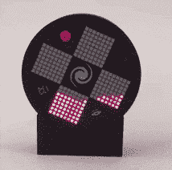

# LED 矩阵沙漏知道哪条路是向上的

> 原文：<https://hackaday.com/2021/10/08/led-matrix-hourglass-knows-which-way-is-up/>

【无畏之夜】的[光滑的双沙漏](https://www.fearlessnight.com/hourglass/index.html)不仅仅用 led 模拟沙子，它还模拟重力对那些模拟粒子的影响，并提供了一些不同的模式选项。

该单元使用 Arduino(带 ATMEGA328P)和 MPU-6050 加速度计分线板来感测方向和运动，其余的只是软件问题。Arduino 和 MPU-6050 板都很容易获得，并且不是特别昂贵，LED 矩阵显示器只是 8×8 红色/绿色 LED 阵列，每个由 HT16K33 LED 控制器 IC 驱动。

外壳和支架都是 3D 打印的，PCB 不仅可以安装组件，还可以作为顶盖，PCB 的丝网印刷层可以制作一些方便的标签。这是一个聪明的方法，使印刷电路板拉双功能，这是一种技术[无畏之夜]也用在他们早期的光学特雷门设计。

那些想自己制作一个的人会发现所有的设计文件和源代码都可以从项目页面方便地获得。它可能无法以传统的方式显示时间，但看到沙漏显示器对设备的方向做出反应确实是一个很好的效果。