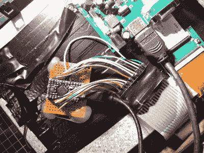

# 迷你终端变成迷你笔记本电脑

> 原文：<https://hackaday.com/2021/10/08/minitel-terminal-becomes-mini-laptop/>

1980 年，当电信公司推出 Minitel 系统时，法国向未来迈出了一步——这是网络的前身，用户可以通过一个小终端购物、购买火车票、查看股票、收发电子邮件。2009 年，Minitel 每月仍有 1000 万次连接，但这项服务在 2012 年停止了。

 所以，你可以想象此时有多少 Minitel 终端在四处浮动。[高奇]不久前在车库拍卖中买了一台[并把它改装成一台电池供电的笔记本电脑](https://www.instructables.com/Old-School-Minitel-Laptop/)，用来在课堂上记笔记。对我们来说幸运的是，[Gautchh]最近开源了这个项目，并给了我们一个线路图、STLs、BOM，以及一个很好的构建过程。

[Gautchh]从掏空 Minitel 开始，但保留了电源按钮和看起来像 AA 电池的 très 别致的电源指示灯。新的 10.4 英寸 LCD 屏幕由四个 3D 打印的角块和一点热熔胶固定，原始键盘(我们很想敲击)现在连接到 Arduino Pro Micro。通过后面一个方便的小舱口，可以很容易地进入主大脑——覆盆子酱 3B。好吧，看起来我们有一个新的易趣提醒要设置。

想要更多美好的东西吗？看看这个法国电脑画廊，或者[一个更传统的带树莓皮的迷你电脑](https://hackaday.com/2016/05/22/a-minitel-terminal-as-a-usb-linux-terminal/)。