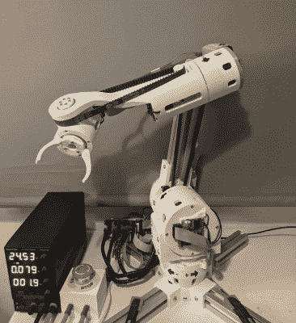
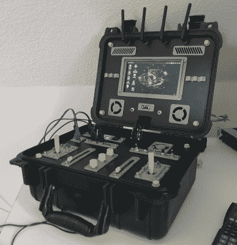

# 见见第四轮 Hackaday 奖的获奖者:重新定义机器人

> 原文：<https://hackaday.com/2021/10/07/meet-the-winners-of-the-hackaday-prize-round-four-redefine-robots/>

评委的投票已经开始，我们很荣幸地向大家介绍 2021 年 Hackaday 奖第四轮的十位获奖者。我们喜欢机器人，很明显你也喜欢！今年提交的项目数量之多、范围之广令人应接不暇。

没有机器人手臂的机器人比赛是不完整的，虽然其中一些人进入了决赛，但我们特别喜欢 [CM6](https://hackaday.io/project/180588-cm6-compliant-3d-printed-robotic-arm) ，他们真的全力以赴。这是一个研究级机器人，预算不太适合学生，具有定制的顺从机制，因此它可以与它的肉伙伴玩得很好。

有了六个自由度和六个电机，传动系统的预算可以很快失去控制，所以我们特别高兴地看到定制，开放，无刷电机驱动板用于降低入场成本。即使你不会做一个 100%忠实的 CM6 克隆，你也会从构建过程中学到很多。哦，我们有没有提到它有一个软件堆栈？

说到 stacks，来看看 [Stack-chan](https://hackaday.io/project/181344-stack-chan-javascript-driven-super-kawaii-robot) ，一个 JavaScript 超级可爱的桌面机器人交流者和助手。这个是用来坐在你的桌子上和你的朋友联系的，有点像卡哇伊网真机器人。这里强调的是构建的简单性和软件的可扩展性；这是一个代码骑师的机器人，它看起来像是将你的虚拟想法变成现实的第一步，或者只是在这些奇怪的日子里保持联系。再说，谁能抗拒*可爱*的东西呢？

 当你处于建造一个“机器人”的开发阶段时，你将需要遥测、记录，可能还需要远程控制。[Maximiliano Palay]的[机器人地面控制站](https://hackaday.io/project/181111-robotics-ground-control-station)做了所有这些，过度杀戮。为了驱动他的 Cablecam 机器人，这有你可能需要的一切和更多，都装在一个防水的情况下。电脑、屏幕、收音机、操纵杆、滑块和旋钮:如果你的机器人需要控制，这就是你的控制器。Cyberdeck 与 remote 相遇？如果你建造了其中的一个，你可以用它来制作你所有的机器人作品。

当然，这还不是全部！我们有将近 100 份参赛作品和 10 名决赛选手，虽然只有决赛选手获得奖金，但你们都值得关注。

## 来自重新定义机器人挑战赛的十名决赛选手:

*   [CM6](https://hackaday.io/project/180588)
*   [晚期](https://hackaday.io/project/180210)
*   [我的机械 2021](https://hackaday.io/project/181165)
*   [Stack-chan——JavaScript 驱动的超级卡哇伊机器人](https://hackaday.io/project/181344)
*   [辅助机器人操作器和 6 自由度控制器](https://hackaday.io/project/181205)
*   [带边缘脉冲的自主垃圾探测机器人](https://hackaday.io/project/181731)
*   [紫外线消毒自主机器人](https://hackaday.io/project/181361)
*   [FiberGrid 重新加载](https://hackaday.io/project/181339)
*   [自动化 3D 打印机的机器人](https://hackaday.io/project/181649)
*   [机器人地面控制站](https://hackaday.io/project/181111)

The [HackadayPrize2021](https://prize.supplyframe.com) is Sponsored by: