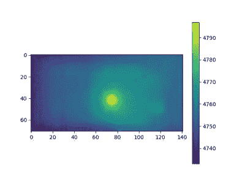

# 世界上最便宜也可能是最差的红外相机

> 原文：<https://hackaday.com/2021/10/07/worlds-cheapest-and-possibly-worst-ir-camera/>

标题不要怪我们。[CCrome]承认这很可能是市面上最便宜最差的红外相机。这个概念出奇的简单。在 3D 打印机托架上安装一个便宜的 Harbor Freight 非接触式温度计，并使用它来扫描目标。设计文件可在 [GitHub](https://github.com/ccrome/temperature_scanner) 上获得。

当然，有一个 Arduino 来获取数据并将其发送到 PC。一些 Python 代码负责将其转换成图像。

也许你不需要相机，但拥有一种与 11 美元的红外温度传感器通信的方法可能有一天会派上用场。你必须把测量按钮压下来，所以[CCrome]使用 3D 打印机为按钮制作了一个夹子，同时也将弹簧针固定在 PCB 上。我们可能会尝试在开关上焊接，并将导线焊接到焊盘上。但是，话说回来，你无论如何都需要一台 3D 打印机来完成这个项目。

不要期望从真正的热传感器得到的结果。如果你想要的话，你可能不得不[自己动手](https://hackaday.com/2017/02/08/diy-thermal-camera-thats-better-and-cheaper-than-a-flir/)或者敞开你的钱包。如果你需要一些用例的灵感，看看几年前的[热感相机大赛](https://hackaday.com/2018/07/18/hot-camera-contest-build-a-battery-powered-thermal-camera/)。