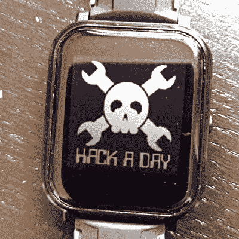

# 黑客与中国

> 原文：<https://hackaday.com/2021/10/09/hackers-and-china/>

开源世界和中国制造业有着长久的关系。大约 15 年前，一个大话题是公司如何开源他们的硬件设计，而不被来自海外的竞争逼得破产。Sparkfun、Adafruit、Arduino、Maple Labs、Pololu 等公司证明了这并非不可能。

也许十年前，中国公司开始挑选有趣的黑客项目并制作它们。这给了我们像 AVR 晶体管测试仪和 the NanoVNA 这样的热门产品。在过去的几年里，我们已经看到开源硬件和软件项目[故意针对中国制造商](https://www.expresslrs.org/1.0/)，并取得了胜利。我们负责设计和编码，他们负责制造、销售和分销。

 但这是另外一回事:[bangle . js 手表](https://hackaday.com/2021/10/05/hackable-smart-watch-is-also-open-source/)将一款本质上平庸的中国智能手表进行固件更新，并作为开源智能手表向普通大众出售。这些预破解的手表正在 Kickstarter 上出售，尽管这些作品是基于[以前黑客对非开放手表硬件的逆向工程工作](https://hackaday.com/2020/01/30/sma-q2-smart-watch-is-completely-hackable/)，但它是由运行它的 Espruino JavaScript-on-embedded 语言背后的主要推动者出售的。

我们有一个廉价的商品智能手表，坦率地说，它的固件很普通，被黑客接管，被黑客在 Kickstarter 上重新刷新，重新贴牌和出售。作为(强制)开放的结果，有一个[相当大的应用商店](https://banglejs.com/apps/)将运行在这个平台上，使得它比以前更有用*和*对黑客友好。

这会促进销售吗？中国会注意到黑客的工作吗？这个项目，以及类似的项目，会不会以另一种新的黑客/中国关系而告终？我们在看。

This article is part of the Hackaday.com newsletter, delivered every seven days for each of the last 200+ weeks. It also includes our favorite articles from the last seven days that you can see on [the web version of the newsletter](https://mailchi.mp/hackaday.com/hackaday-newsletter-649368). Want this type of article to hit your inbox every Friday morning? [You should sign up](http://eepurl.com/gTMxQf)!