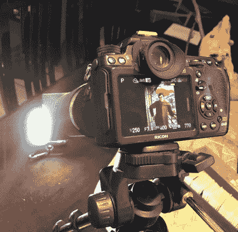

# 3D 打印适配器将载玻片置于最佳光线下

> 原文：<https://hackaday.com/2021/10/12/3d-printed-adapter-puts-slides-in-their-best-light/>

如果你有家庭老照片的幻灯片，你很有可能曾经考虑过将它们数字化，但也许不知道最好的方法。在这种情况下，这个由[罗斯季斯拉夫·珀森] 设计的 [3D 打印适配器可以让你用标准 DSLR 拍摄幻灯片，这可能正是你所期待的。](http://persion.info/projects/slides/)

 这个想法很简单，你把幻灯片放在适配器里，调好焦距，然后抓拍一张照片。但是当然，你也必须提供一些照明。在这种情况下，相机安装在三脚架上，并对准合适的光源。一旦你做了一点实验，并得到了你想要的背光图像，你就可以锁定一切，轻松地快速浏览一堆经典的家庭记忆。

对于这样一个直白的概念，我们真的很欣赏执行中的小细节。例如，【罗斯季斯拉夫】不仅仅是在 DSLR 的镜头上滑动一个 3D 打印的圆柱体，而是想出了一个泡沫填充的“垫片”，它足够坚固，可以在不损坏任何东西的情况下固定适配器。由两部分组成的滑动垫片有一点弹性，可以将所有东西都固定住，这也是一种非常好的触感。

像这样的方法对于大多数家庭可能拥有的幻灯片数量来说应该很好，但是如果你需要数字化成千上万的图像，[一些自动化肯定会有所帮助](https://hackaday.com/2019/04/21/a-high-speed-slide-scanner-build/)。