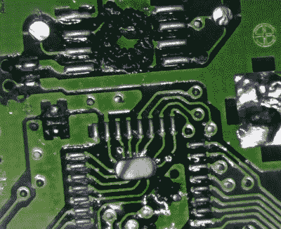

# 溢出的橙汁对塞尔达游戏机墨盒有影响

> 原文：<https://hackaday.com/2021/10/13/spilled-oj-does-a-number-on-zelda-game-boy-cartridge/>

当[【泰勒·伯利】第一次打开*塞尔达传说:季节先知*](https://hackaday.io/project/182041-hidden-orange-juice-kills-zelda-game) 的弹药筒时，*看起来肯定不像是被浸在腐蚀性的橙汁里。但是，外表可能具有欺骗性，虽然游戏的所有者确实在清理 PCB 表面方面做了令人钦佩的工作，但墨盒已经不起作用了。显然，这是一个棘手的情况。*

从 PCB 上拆下所有组件后，[Taylor]很快就能拼凑出发生了什么。尽管游戏在溢出后进行了大力清洁，果汁还是在棋盘上的每个 IC 下找到了自己的路。谁知道在这些角落和缝隙中放置了多久，汁液开始侵蚀 PCB 上的痕迹。让游戏恢复运行自然需要大量的电路板维修，但他们不会无缘无故地叫他*焊锡*。

Corrosion lurking under each chip.

在下面的视频中，你可以看到[Taylor]有条不紊地刮去电路板上的腐蚀，然后开始用 30 号线重建受损的连接。他使用镊子，通过数字显微镜观察这一过程，熟练地弯曲导线，使其符合原始迹线的形状，并用焊料将新导线固定住。他甚至着手修复通向弹药筒上各种测试点的痕迹；这是完全不必要的铺张浪费，但我们当然不会抱怨。看他工作有一种放松的特质，所以我们不急于看他最新的视频结尾。

修好主板后，他更换了所有的组件，并对原来的 Game Boy 颜色进行了测试。确认林克 2001 年的外出工作如预期的那样，他用几层喷涂保形涂层完成了工作。运气好的话，下一次这种特殊的子弹必须面对一些溢出的果汁时，它会马上滚下来。

这不是我们第一次看到[【泰勒】费力地重新组装一个游戏机盒](https://hackaday.com/2021/09/15/bringing-a-ruined-game-boy-cart-back-to-life-with-tons-of-soldering/)，当然也不是我们第一次看到他[完成一些特别令人印象深刻的焊接](https://hackaday.com/2021/01/05/xbox-controller-mod-gets-serious-about-stick-drift/)壮举。他的工作总是提醒我们，耐心和稳健的手真的可以创造奇迹。

 [https://www.youtube.com/embed/hOL2mmSbzdo?version=3&rel=1&showsearch=0&showinfo=1&iv_load_policy=1&fs=1&hl=en-US&autohide=2&wmode=transparent](https://www.youtube.com/embed/hOL2mmSbzdo?version=3&rel=1&showsearch=0&showinfo=1&iv_load_policy=1&fs=1&hl=en-US&autohide=2&wmode=transparent)

