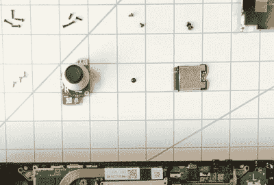

# 阀门勉强显示如何修改蒸汽甲板

> 原文：<https://hackaday.com/2021/10/14/valve-reluctantly-shows-how-to-mod-the-steam-deck/>

[正如 Valve](https://www.youtube.com/watch?v=Dxnr2FAADAs) 的官方教学视频中的解说员多次提醒观众的那样，游戏公司*真的*宁愿你不要打开你全新的 Steam 甲板，开始四处闲逛。如果你开始更换硬件，他们不能保证他们的软件能正常工作，而且因为还没有替换部件的来源，所以你在维修方面也没什么可做的。

也就是说，Valve 确实认为你有权拆开自己的设备，并制作了下面的视频，以帮助那些愿意冒险打开新系统的人。具体来说，该视频讲述了如何更换掌上电脑上最容易磨损的物品，即拇指棒和固态硬盘。经过几年的艰苦使用后，库存拇指棒似乎不可避免地会磨损，所以我们很高兴看到它们是容易拆卸的模块。至于 SSD，随着未来几年的上市，用户理所当然地希望将其换成更快、更高容量的型号。

Sooner or later, these are going to need to be replaced.

现在要明确的是，我们感谢 Valve 制作这个视频，并希望看到其他制造商如此积极。但我们不得不承认，它的一些信息看起来确实有点重。解说员警告说，由于系统锂离子电池可能破裂的危险，打开蒸汽甲板的用户实际上是在把自己的生命掌握在自己手中，这对于我们的口味来说有点夸张。那些不断提醒你会把工作搞得多么糟糕的话，听起来就像是过度说教，尽管平心而论，我们可能不是预期的观众。

除了其明显的游戏功能，[我们还很兴奋地想看看 Steam Deck](https://hackaday.com/2021/08/16/valve-sells-software-so-whats-with-all-the-hardware/) 的社区能做些什么。有了这样的官方参考资料，也许我们甚至会在不久的将来看到一些硬件的修改。虽然我们不会责怪你中途按了静音键。

 [https://www.youtube.com/embed/Dxnr2FAADAs?version=3&rel=1&showsearch=0&showinfo=1&iv_load_policy=1&fs=1&hl=en-US&autohide=2&wmode=transparent](https://www.youtube.com/embed/Dxnr2FAADAs?version=3&rel=1&showsearch=0&showinfo=1&iv_load_policy=1&fs=1&hl=en-US&autohide=2&wmode=transparent)

【感谢 burningbroccoli 的提示。]