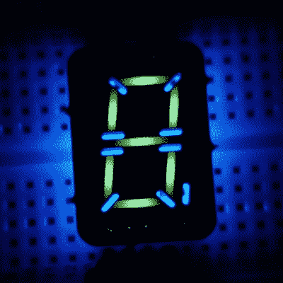

# 独特的七段显示依赖于 FR-4 荧光

> 原文：<https://hackaday.com/2021/10/16/unique-seven-segment-display-relies-on-fr-4-fluorescence/>

当你用黑光灯照射日常物品时，你看到的东西很有趣。我们强烈建议不要在酒店房间里这样做，但是如果你用紫外线照射，比如说，一个印刷电路板上，你可能会看到[Sam Ettinger]做了什么，这使他建造了这些很酷的低调的七段荧光 PCB 显示器。

 事实证明，至少有一些 FR-4 多氯联苯在紫外线下会发出荧光，发出幽灵般的蓝绿色光芒。看到了这种可能性，[Sam]设计了一种 PCB，在铜和阻焊膜上开孔，形成传统的七段显示器形状。PCB 的背面有用于 UV LEDs 和限流电阻器的焊盘，这些焊盘透过电路板发光，并使段发光。片段之间的通槽防止来自一个片段的光溢出到下一个片段；虽然[Sam]没有填充这些槽，但它们很容易被焊料填满。FR-4 的荧光特性，以及片段的亮度和色调，似乎因电路板厚度和 PCB 制造商而异，但看起来大多数 PCB 会显示出相当好的结果。

我们会说，第一个明显的改进可能是用黑色环氧树脂覆盖显示器的背面，以减少杂散光，并提高对比度。但是他们看起来很棒。我们还可以看到如何显示其他形状，如图标和简单的符号。或者甚至是字母数字字符——比如说，我们以前不是见过类似于的[吗？](https://hackaday.com/2019/03/27/leds-shine-through-pcb-on-this-tiny-word-clock/)