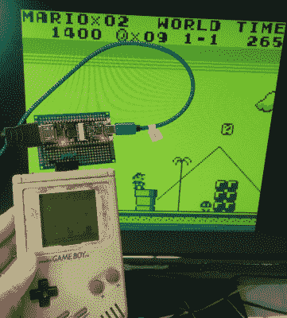

# FPGA 板为原来的 Game Boy 增加了 VGA 和 HDMI 接口

> 原文：<https://hackaday.com/2021/10/15/fpga-boards-add-vga-and-hmdi-interfaces-to-the-original-game-boy/>

经典的游戏男孩仍然是逆向计算领域的一个坚定的最爱。虽然它在当时是革命性的，但以今天的标准来看，它的显示屏相当原始，没有背光，可用面积只有 47 毫米 x 44 毫米。[Martoni]通过开发 [GbVGA](https://github.com/Martoni/GbVga) 和 [GbHdmi](https://github.com/Martoni/GbHdmi) 这两个项目，找到了解决这个问题的方法，这两个项目使 Game Boy 能够连接到外部显示器。通过这种方式，你可以玩超级马里奥，而不会让你的眼睛疲劳，我们也可以想象那些在线玩游戏的人的潜在用途。

从 Game Boy 中获取图像数据出奇的简单，之前[已经在](https://hackaday.com/2010/11/10/diving-deep-into-the-game-boy-lcd-protocol/)和[做过几次了](https://hackaday.com/2017/08/01/using-a-logic-analyzer-to-generate-screenshots-from-a-game-boy/)。基本上，CPU 和 LCD 屏幕之间的连接是一个具有 4 MHz 时钟、两条数据线和两条同步线的串行接口。[Martoni]使用从 Game Boy 的塑料外壳伸出的引脚接头将它们连接到一个小型 FPGA 板。有问题的主板是 VGA 版本的 Fireant 和型号的 Tang Nano 主板。在这两种情况下，FPGA 都会从 Game Boy 的 LCD 界面中读出每一帧，并将提取的图像绘制到显示器上，使用与原始屏幕相同的四种绿色。

[Martoni]表示，这些项目的最终目标是为最初的 Game Boy 制作一个类似开关的扩展坞，这绝对是我们所期待的。虽然给 Game Boy 增加外部显示器并不是全新的事情，但我们喜欢这种实现的简单性，以及任何人都可以对其进行改进的事实，这要归功于完整的源代码。类似的黑客攻击也发生在更新的[游戏机口袋](https://hackaday.com/2010/12/12/game-boy-vga-using-an-fpga/)和[游戏机进阶](https://hackaday.com/2017/05/30/hdmi-out-on-the-gameboy-advance/)上。