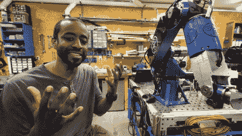

# 让你的项目动起来:杰里米·菲尔丁发表 Remoticon 主题演讲

> 原文：<https://hackaday.com/2021/10/18/making-your-projects-move-jeremy-fielding-to-deliver-remoticon-keynote/>

我们非常兴奋地宣布，杰里米·菲尔丁将于 11 月在 Hackaday Remoticon 上发表主题演讲！[立即获得免费机票](https://www.eventbrite.com/e/hackaday-remoticon-2021-tickets-172183193567?aff=thorneKeynote)！

我们在这个社区中选择处理的项目通常需要很长时间才能完成。零件、工具、专业知识、时间；所有这些都是将项目从概念变为现实的关键。但是，你的零件库有多深，或者你的商店设备有多好，这些都无关紧要，除非你有一个让一切运转起来的东西:激情。激情是保持项目向前滚动的动力，粘贴不可避免的路障和干扰；当我们认为我们已经尝试了所有的东西时，这让我们回到板凳上去尝试新的东西。

Jeremy Fielding [showing off his robot arm](https://www.youtube.com/watch?v=HMSLPefUVeE) back in April

杰里米·菲尔丁显然拥有理解、创造和创新的激情。任何看过他的几个 YouTube 视频的人都知道他有多喜欢让事情进展。他目前的项目是一个七轴工业机器人手臂，这是一个非常令人印象深刻的建筑，很容易被误认为是商业产品。也许最令人印象深刻的是，实现这一目标所需的许多技能，如焊接铝和机械加工，都是杰里米在飞行中自学的技能。谈激情！

在他的主题演讲中，Jeremy 将重点介绍如何建造移动的硬件。我们中的大多数人都相当擅长将一些闪烁的灯光或者移动一些小步进器或伺服系统的项目放在一起。但是，正如杰里米为他的机器人手臂和其他项目所做的那样，扩大规模带来了新的挑战:我应该选择哪种类型的电动机？我该如何权衡扭矩和速度？我真的想用电动马达吗——也许气动马达会更好？我的控制选项是什么？这些问题对于老手和新手来说都是令人生畏的，Jeremy 将专注于如何处理这些和我们项目中出现的其他机电挑战。

除了机械工程的(字面上的)螺母和螺栓，杰里米的热情还在另一个地方闪耀:他对交流他所学到的东西的热情。他的演讲风格和热情很有感染力，我们确信这将在他的主题演讲中体现出来。杰里米幻想自己是一名“精巧装置工程师”，这是看待他所做的事情的一种恰当而有趣的方式。精巧装置的建造者们注意了——你要确保你不会错过这个！

## 提案征集仍在进行中！

我们仍在寻找关于硬件创造的精彩演讲，因此征集提案的时间已延长至 10 月 20 日。记住，[早点买票](https://www.eventbrite.com/e/hackaday-remoticon-2021-tickets-172183193567?aff=thorneKeynote) —知道会有多少人来真的有助于我们进行基础设施规划，这样我们就可以给每个人一个高质量的体验。

