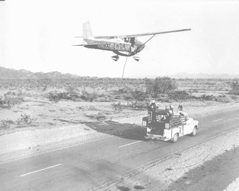
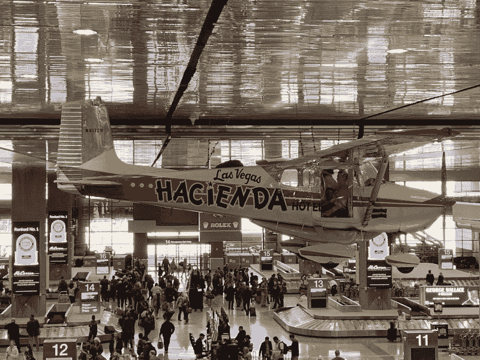

# 有史以来最长的一次飞行是乘坐塞斯纳 172 飞机超过 64 天

> 原文：<https://hackaday.com/2021/10/25/the-longest-ever-flight-was-over-64-days-in-a-cessna-172/> 飞机飞行时间最长超过 64 天

通常，当我们想到长航时，我们首先想到的是军事行动。配备训练有素的机组人员的大型飞机将长时间飞行，使用空对空加油来长时间停留在高空。

然而，许多持续时间最长的飞行完全是作为民用业务进行的。最长的一次恰好是由最不起眼的飞机塞斯纳 172 承担的。从 1958 年 12 月到 1959 年 2 月，鲍勃·蒂姆和约翰·库克出发去创造历史。这对组合在空中停留了整整 64 天 22 小时 19 分钟， [创造了一项记录，该记录保持至今](https://www.aopa.org/news-and-media/all-news/2008/march/pilot/endurance-test-circa-1958) 。

## **耐力测试**

人们可能会认为，这样的努力是为了在航空航天工程领域突破极限或开辟新天地。然而，真正的事实是，鲍勃·蒂姆是一名老虎机机械师和前轰炸机飞行员，他在拉斯维加斯的庄园赌场工作。经营者 Doc Bailey 总是在寻找促销的想法，Timm 向他的老板推销，在一架带有赌场品牌的飞机上创纪录的尝试将是一个很好的方式。贝利同意了，并为此投入了 10 万美元。

为特技飞行准备飞机的改装花了一年的大部分时间。这架小型塞斯纳飞机装有一个 95 加仑的腹部油箱，配有一个电泵，可以根据需要将燃料输送到主翼油箱。还增加了特殊的管道，允许在发动机仍在运转时更换机油和过滤器。

内部被剥离，标准的副驾驶门也被移除，取而代之的是折叠式手风琴门。还安装了一个平台，可以从飞机的副驾驶一侧伸出来。这让副驾驶在关键的加油操作中有了更多的活动空间。

## 保持发动机转动

The Hacienda Cessna 172 refuelling during its record flight. Source: [McCarran Airport](https://twitter.com/LASairport/status/1093653131848642560/photo/1)

加油是通过一个绞盘将一个吊钩下降到一辆加油车来完成的，这辆加油车会在一段笔直的道路上尾随飞机，通常一天两次。绞盘将从卡车上拉起一根燃油软管，用于在大约三分钟内填充腹部油箱。同一个系统被用来定期提取食物、油和其他供应品，如用于剃须和洗澡的毛巾和水。

最初的尝试面临问题。尽管首席机械师 Irv Kuenzi 提出了抗议，但在 Timm 的坚持下，这架飞机安装了大陆汽车公司的全新发动机，并安装了酒精喷射系统。目的是减少长时间飞行过程中的积碳，但发动机排气阀被烧毁，这限制了第三次尝试。前三次飞行后，飞机从未在空中停留超过 17 天。

其他的障碍也出现了。蒂姆和他的副驾驶相处不好，飞行员吉姆·赫思和比尔·伯克哈特刚刚创造了他们自己的记录。两人成功驾驶他们自己的塞斯纳 172 飞行了整整 50 天，于 1958 年 9 月 21 日着陆。很明显需要改变。

为了下一次尝试，Kuenzi 重新安装了飞机的原始引擎，该引擎已经运行了 450 个小时。酒精喷射系统被悄悄修改，无害地将酒精喷射到船外，而不是进入发动机。原来的副驾驶被解雇了，33 岁的约翰·韦恩·库克，一名飞行员和飞机机械师，被取代。

1958 年 12 月 4 日下午 3 点 52 分，飞机再次从拉斯维加斯的麦卡伦机场起飞。监控记录的官员驾驶一辆敞篷福特雷鸟在跑道上追赶飞机，在轮胎上涂上白色油漆作为指示，以确保飞机在尝试期间没有进行任何秘密着陆。

在将近 65 天的飞行中，飞机被它的卡车加油超过 128 次。这一点以及驾驶飞机的工作让蒂姆和库克忙得不可开交。空闲时间都用来看漫画和做简单的游戏，比如数下面路上的车来打发时间。

## 过长途飞行的生活

大厨们在庄园为两人烹制了新鲜的食物，尽管这些食物必须被切碎，以便放入保温瓶中才能被送上飞机。浴室的职责是用一个折叠的野营厕所和塑料袋来处理，然后把它们放在无人居住的沙漠地区。

正如人们所料，这次长途飞行并非一帆风顺。1959 年 1 月 12 日的一次事故中，蒂姆在副驾驶门外的平台上洗澡时被抓了出来。由于库克在驾驶，飞行员意识到飞机不会在平台伸展的情况下越过山脊，于是迅速向蒂姆喊停。据报道，蒂姆光着身子，嘴里还叼着牙刷，与平台搏斗，设法及时避开了山脊。这种恐慌促使两人重新安排他们的游泳活动，以便在飞越安全区域时进行。

随着时间的推移，长时间的飞行、高负荷的工作和糟糕的睡眠开始让机组人员疲惫不堪。1 月 9 日凌晨 2 点 55 分左右，蒂姆在加州布莱斯上空飞行时睡着了，这是他 4 小时轮班结束前的几分钟。库克仍然在睡觉，蒂姆最终在凌晨 4 点醒来，飞机已经自己飞行了一个多小时，机翼水平米切尔自动驾驶仪使飞机保持在空中。飞行结束后，蒂姆对记者说，“我对自己发誓，我永远不会告诉约翰发生了什么。”

随着时间的推移，设备故障开始累积。发电机故障意味着必须使用手泵向机翼油箱输送燃油。其他故障导致自动驾驶仪、各种灯、转速表以及腹部油箱和关键绞盘的燃油表失灵。随着发动机连续运行超过 1000 小时，积碳也开始降低发动机功率，使油箱加满的飞机很难爬升。

## 回到地球

1959 年 2 月 7 日，飞机终于降落在麦卡伦机场。据报道，飞行员不得不被搀扶出飞机，在长时间的冒险后，飞机看起来有些破旧。勇敢的塞斯纳在它的旅程中已经飞行了超过 15 万英里。

The plane now hangs in McCarran International Airport. Note the sliding door on the co-pilot’s side, and the belly tank underneath. Source: [McCarran Airport](https://twitter.com/LASairport/status/1093653131848642560/photo/2)

之后，库克继续担任飞行员，而蒂姆继续在赌场的老虎机上工作。至于这架飞机，它在创纪录的飞行后在庄园展示了两年。几年后，它在加拿大被新主人拥有，直到 20 世纪 80 年代末，蒂姆的儿子史蒂夫找到了它，并把它带回了拉斯维加斯。这架飞机现在停在麦卡伦国际机场，在入境旅客的行李认领处上方。

这次飞行是机器和人耐力的一个很好的例子。让一台 20 世纪 50 年代的小型飞机发动机连续运转 1500 个小时是非常了不起的。同样，在这样一个持续噪音的狭小空间里生活两个多月也是一种巨大的壮举。可能正是因为这个原因，这个记录还没有被打破。

人们可以想象，以世界军队的资源，在更大的轰炸机或运输机上进行更舒适的记录尝试。有了更多的船员和更多的活动空间，这项壮举就不必如此繁重。然而，鉴于一架小小的 20 世纪 50 年代塞斯纳飞机能够取得如此伟大的记录，再往前走一步也许就没什么可证明的了！