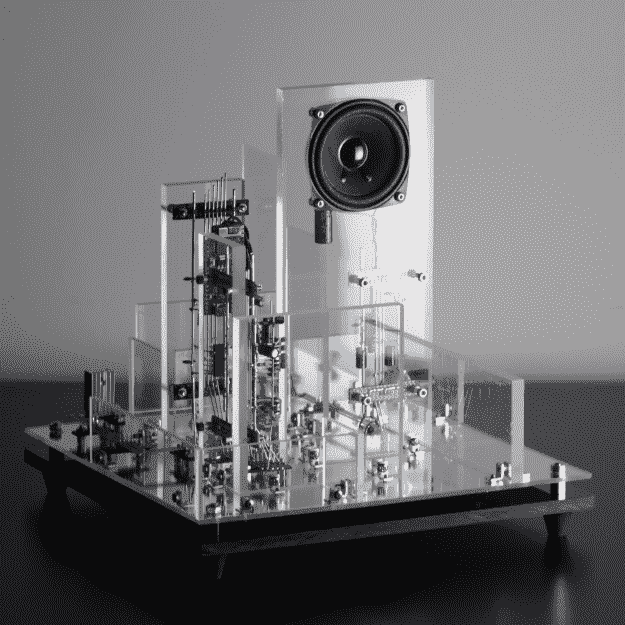

# 迷宫般的电路雕塑用声音和光唤起心情

> 原文：<https://hackaday.com/2021/10/20/labyrinthian-circuit-sculpture-evokes-moods-with-sound-and-light/>

在维多利亚时代作家奥斯卡·王尔德写的一封著名的信中，他写道:

艺术是无用的，因为它的目的仅仅是创造一种情绪。它并不意味着以任何方式指导或影响行动。它是超级无菌的，它的快乐是无菌的。”

我们不禁想知道，当[Eirik Brandal]写信告诉我们关于[ddrysfed](https://hackaday.io/project/182215-ddrysfed)的电子声光雕塑时，他是否唤起了这种王尔德的想法，他称之为“无用的应用电子”考虑到休息时间下面的视频所营造的气氛，我们不得不承认它确实非常巧妙。但如果它是为了启发和引起惊叹而服务的，它真的没有用吗？让哲学家们进行哲学思考。开始黑吧！

[Eirik]自己受到了迷宫的启发，比如那些在儿童活动书籍和杂志中发现的迷宫，其目标是通过从头到尾画一条实线来让孩子忙起来。考虑到这些因素，[Eirik]将 ddrysfeö建成了一个错综复杂的电子产品、金属、透明镜面丙烯酸树脂和电镀钢的混合体，所有这些都被扔进了一个三维漩涡中。

ddrysfeöd is at home evoking moods in the light as well as the dark.

LED’s of red and white oscillate in time with each other. Orchestrating the multimedia symphony is an ESP32, with one core relegated to dealing with the mundane functions of the sculpture while the other waves its electronic wand to keep the ensemble suitably arranged. LED’s are bored into the base, and the acrylic is sanded on the edges to diffuse the supplied light. The electronics run on the usual  +5 V, but a +12 V power supply gives volume to the LM380 audio amplifier. We also appreciated that [Eirik] expanded his skills on this project by using Sketchup to plan out the project, even printing the patterns for cutting and drilling the acrylic glass.

如果[Eirik]的建造风格看起来很熟悉，那可能是因为你在 Hackaday 的电路雕塑比赛上见过它，[他的一些作品被评为最美丽的](https://hackaday.com/2020/11/20/no-wonder-these-projects-won-the-circuit-sculpture-contest/)。你还可以一饱眼福，看看卫星形状的[光束机器人。记住，如果你遇到了让你按下按钮的事情，请通过](https://hackaday.com/2019/04/04/solar-circuit-sculpture-pumms-the-night-away/)[热线](https://hackaday.com/submit-a-tip/)告诉我们！

 [https://www.youtube.com/embed/VkcRibctD9E?version=3&rel=1&showsearch=0&showinfo=1&iv_load_policy=1&fs=1&hl=en-US&autohide=2&wmode=transparent](https://www.youtube.com/embed/VkcRibctD9E?version=3&rel=1&showsearch=0&showinfo=1&iv_load_policy=1&fs=1&hl=en-US&autohide=2&wmode=transparent)

