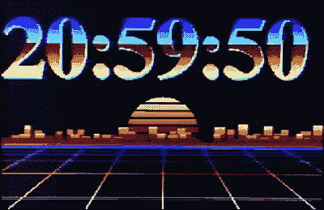

# ESP32 时钟推动超出复合图形

> 原文：<https://hackaday.com/2021/10/19/esp32-clock-pushes-outrun-graphics-over-composite/>

我们已经介绍了很多由 ESP32 供电的时钟，但来自[马尔西奥·特谢拉]的这款时钟确实很特别。微控制器不是驱动传统的物理显示器，而是[产生一个动画数字时钟](https://github.com/marciot/esp32-dali-clock)的复合视频信号。这可以输入到你想要的任何设备中，但是考虑到 80 年代的 synthwave 风格，你可能会想找一个合适的复古 CRT 来做这件事。

 具体来说，这是一种“达利”钟的变体，其中每个数字似乎都融化并变形为其继任者。尽管他的版本不一定与所有以前的版本共享代码，但[马尔西奥]确实称赞了那些早在 1979 年就实现了类似视觉技巧的开发人员。鉴于这一特定动画的年份，霓虹天际线和无限滚动的网格肯定感觉像一个完美的组合。

想给自己的工作台添加一点 vaporwave vibe 吗？假设你已经有了一台 80 年代风格的 CRT，你所需要的只是一个 ESP32 和插入复合视频端口的两根线。一个接地，另一个连接芯片的模拟引脚。一旦一切都启动了，你就可以用一个基于网络的界面来配置时钟了。没有比这更简单的了。

在文档中，[马尔西奥]列举了几个开源项目，这些项目对他的研究有很大帮助。[【bitluni】所做的开创性工作](https://hackaday.com/2018/02/22/software-defined-television-on-an-esp32/)将视频从 ESP32 中取出是理所当然的，但他也向[【rossumur】致敬，感谢他为微控制器编写的 8 位游戏控制台仿真器](https://hackaday.com/2020/06/09/run-your-favorite-8-bit-games-on-an-esp32/)。像这样的项目是一个极好的例子，说明了当一个社区共同努力真正挑战极限时会发生什么。

 [https://www.youtube.com/embed/xGliOsGXlng?version=3&rel=1&showsearch=0&showinfo=1&iv_load_policy=1&fs=1&hl=en-US&autohide=2&wmode=transparent](https://www.youtube.com/embed/xGliOsGXlng?version=3&rel=1&showsearch=0&showinfo=1&iv_load_policy=1&fs=1&hl=en-US&autohide=2&wmode=transparent)

