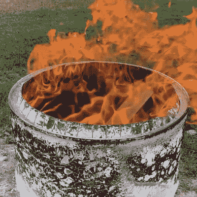

# 无烟燃烧桶让你后院的火更干净

> 原文：<https://hackaday.com/2021/10/21/smokeless-burn-barrel-makes-your-backyard-fire-much-cleaner/>

旧的 55 加仑桶通常被改造成消防桶，只需在墙上凿几个洞。一般来说，他们足够适合的目的，但可以有一个非常冒烟的输出，特别是当超载。然而，这个来自[建筑材料很有趣]的设计将两个桶合二为一，创造了一个燃烧效率更高、烟雾更少的桶！(视频，下面嵌入。)

Note the vent holes feeding oxygen to the fire just before the barrel outlet.

通过一些巧妙的钢材切割和折叠，一个燃烧桶从原来的两个桶变成了一个，有助于通过两个巧妙的设计功能完全消除烟雾。首先，由于桶底部的进气口，充足的空气被提供给火。其次，桶中桶的设计，加上一些巧妙的通风口，有助于在火离开桶之前为火提供新鲜空气。这种额外的氧气供应有助于在出口处产生二次燃烧，燃烧掉所有通常以烟雾形式排出的物质。

这个设计不仅仅是在一个旧鼓上打几个洞，还需要更多的工作，但结果无疑令人印象深刻。无烟燃烧桶的输出看起来更热更干净。我们也见过类似的设计[用于供应车间热量](https://hackaday.com/2011/10/01/sustainability-hacks-external-wood-burner/)。休息后的视频。

 [https://www.youtube.com/embed/07P-6gqYg2g?version=3&rel=1&showsearch=0&showinfo=1&iv_load_policy=1&fs=1&hl=en-US&autohide=2&wmode=transparent](https://www.youtube.com/embed/07P-6gqYg2g?version=3&rel=1&showsearch=0&showinfo=1&iv_load_policy=1&fs=1&hl=en-US&autohide=2&wmode=transparent)

