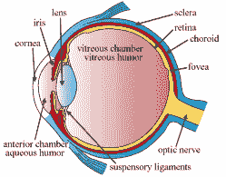
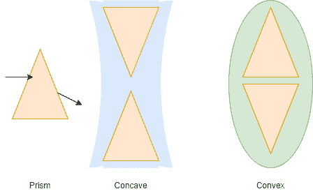

# 众目睽睽下的科技:眼镜

> 原文：<https://hackaday.com/2021/11/16/tech-in-plain-sight-eyeglasses/>

戴眼镜的，尝试一个小实验。摘下你的眼镜，看看这一页，或者至少，看一些你不戴眼镜看不清楚的东西。现在想象一下，如果你生活在一个对你的视觉无能为力的时代。如果你戴隐形眼镜或者视力很好——也许你做过手术——那么恭喜你。但是对我们大多数人来说，视力随着年龄的增长而变化是生活的事实。甚至许多年轻人需要眼镜或其他干预措施来获得良好的视力。乍一看，你可能会认为眼镜是一个显而易见的发明，但事实证明我们很长一段时间都没有真正的眼镜，现代眼镜确实是一件高科技产品，就藏在你的面前。

## 怎么了？

 

眼睛的部位(CC = BY-SA 3.0 BY[Holly Fischer]

在我们谈论矫正视力之前，了解一下你的眼睛会出什么问题是有帮助的。为了理解这一点，首先回顾一下你的眼睛是如何工作的会有所帮助。

首先，光线通过角膜进入眼睛，角膜是前面一个清晰的圆顶。然后光线穿过瞳孔，中间的黑点。你眼睛的彩色部分，虹膜，控制着多少光线通过，有点像相机上的镜头光圈。

在你的眼睛里是一个透明的晶状体结构，它聚焦光线。它们通过一种果冻状的物质，使你的眼睛保持圆形，焦点位于包含光敏神经的视网膜上。与相机不同，视网膜不像胶片一样是平的，而是弯曲的。然而，像任何相机一样，图像现在是颠倒的，但你的大脑并不介意。不过，说句题外话，如果你翻转你的视觉，让它真的上下颠倒，你的大脑最终会尽职尽责地为你翻转回来，就像你在下面的视频中看到的那样。

 [https://www.youtube.com/embed/Euwp4C6Wt8A?version=3&rel=1&showsearch=0&showinfo=1&iv_load_policy=1&fs=1&hl=en-US&autohide=2&wmode=transparent](https://www.youtube.com/embed/Euwp4C6Wt8A?version=3&rel=1&showsearch=0&showinfo=1&iv_load_policy=1&fs=1&hl=en-US&autohide=2&wmode=transparent)

## 当事情出错时

人们一般认为视力问题是远视或近视。也就是说，模糊的物体分别靠近或远离。然而，你也可能有散光，这只是导致一般的模糊，我们认为的远视可能是由你的眼睛的两个不同的问题引起的。

散光是指角膜的形状不完美，因此进入的光线可能会在视网膜上的多个点上聚集。如果你有散光，所有东西看起来都很模糊，从远处看，像 LED 一样的东西看起来不止一个。

远视是一种远视，当眼睛的长度不正确或晶状体系统的焦距不正确时，就会发生近视或近视。对于远视，图像聚焦在视网膜后面，而近视的焦点在视网膜前面。远视的另一个原因是老花眼，即眼睛的晶状体中心随着年龄的增长而变硬。最终的结果是一样的远视，这就是为什么当我们变老，我们不能阅读小字。

## 光学

You can think of a lens as two prisms either base to base or apex to apex

你可以把一个透镜想象成两个棱镜。对于凹透镜，两个棱镜在顶端相遇。对于凸透镜，它们在底部相遇。如果你不习惯把一个镜头看作一对棱镜，你可能会喜欢下面的视频。

 [https://www.youtube.com/embed/y4gRpFYwwwM?version=3&rel=1&showsearch=0&showinfo=1&iv_load_policy=1&fs=1&hl=en-US&autohide=2&wmode=transparent](https://www.youtube.com/embed/y4gRpFYwwwM?version=3&rel=1&showsearch=0&showinfo=1&iv_load_policy=1&fs=1&hl=en-US&autohide=2&wmode=transparent)

正如视频中提到的，光线会在棱镜底部发生弯曲。好吧，它不会真的弯曲，但这是一个很好的思考方式。因此，当光进入凹透镜时，它倾向于扩散，但通过凸透镜时，它倾向于会聚在离透镜一定距离的一个点上——焦距。

至少对于球面透镜来说是这样的。你也可以有一个[柱面透镜](https://en.wikipedia.org/wiki/Cylindrical_lens)聚焦到一条线而不是一个点。如果你同时需要两种类型的镜片，你需要找到一个[复曲面](https://en.wikipedia.org/wiki/Toric_lens)镜片。

通过使图像在进入你的眼睛之前散开或会聚，眼镜可以矫正常见的视力问题。有了柱面透镜，你也可以矫正散光。显然，如果你有多个问题，你需要一个复曲面镜片。

## 古代史

虽然制作一个镜头并把它挂在你面前看起来很简单，但它有两个部分。首先，你必须知道如何制作一个镜头或者找到一个自然产生的镜头。接下来，你要有如何把它们悬浮在眼前的想法。

玻璃至少存在了 4000 年，但不是高质量的玻璃。有相当多的说法认为古代的透镜用于放大或聚焦太阳来点火，但它们要么是天然的石头，要么是质量非常差的玻璃，对于它们是否适用于任何一种情况还有争议。

罗马人在第一世纪开始擅长制作玻璃，并意识到一块豆状的玻璃——凸透镜——会使物体看起来更大。晶状体这个词来自拉丁语小扁豆的意思。

但是，历史上关于用镜片帮助人们看东西的说法有点模糊。看起来像是一个阿拉伯人在 900 年代创造了阅读石，到了 1000 年它们变得相对普遍。如果你曾经使用过那种固体塑料棒，你把它放在电话簿这样的小东西上，让文本变大，这是同样的想法。当然，材料可以是玻璃或水晶。

## 眼镜到了

This portrait by El Greco from about 1600 shows Cardinal Fernando Niño de Guevara wearing glasses (Public domain)

直到 13 世纪，我们才开始看到我们认为是简单的眼镜。意大利早期的玻璃杯是粗糙的吹制玻璃，带有皮革或木头框架。然而，直到 1600 年左右，你还会把眼镜握在手里，或者把它们放在鼻子上。早期的眼镜都是凸面的，尽管到了 15 世纪凹透镜才为人所知。直到 1604 年，开普勒才解释了为什么它们都能工作。

大约在 1600 年，有人发明了如何把眼镜夹在耳朵上，尽管这通常被认为是爱德华·斯嘉丽在 1727 年发明的。你可以从旁边的埃尔·格列柯的画中看到，一些人早在 1600 年就有了这种风格的眼镜。

耳机改变了游戏规则，尽管你仍然可以找到偶尔的单片眼镜或夹鼻眼镜。仍然有一个主要问题:足以帮助你看清近处事物的眼镜把远处的东西弄得一团糟。

视力不好的本杰明·富兰克林发明了双光眼镜，每个镜片有一个近镜部分和一个远镜部分。有些人声称富兰克林没有发明它们，而是普及了它们。直到 1825 年，天文学家乔治·艾里才发现如何矫正散光。

## 现代眼镜

像所有其他东西一样，眼镜在整个 20 世纪都在加速高科技化。现在镜架是用记忆合金制成的，可以恢复到原来的形状。由特殊材料制成的镜片轻便耐用。它们也可以有涂层来减少眩光，阻挡紫外线，或者在强光下变暗。

最大的改进之一源于双焦点。首先，有三个镜头的三焦点。然而，现在复杂的镜片研磨技术允许渐进镜片，其中镜片具有在整个镜片上连续变化的不同特性。

计算机可以研磨出经典形状的镜片，或者制造出非球面或任意形状的镜片，这些镜片可以用比普通镜片更复杂的方式矫正视力。你可以在下面的视频中看到一个常见的眼镜实验室的流程。

 [https://www.youtube.com/embed/RYrG3G8nhhA?version=3&rel=1&showsearch=0&showinfo=1&iv_load_policy=1&fs=1&hl=en-US&autohide=2&wmode=transparent](https://www.youtube.com/embed/RYrG3G8nhhA?version=3&rel=1&showsearch=0&showinfo=1&iv_load_policy=1&fs=1&hl=en-US&autohide=2&wmode=transparent)

## RX 和其他解决方案

如果你想看眼镜处方，懂拉丁语会有帮助。你会在 OS 和 OD 标题下看到数字，很少看到 OU0。O 代表 oculus(眼睛)，S 代表 sinister(左)，D 代表 dextrus(右)。U 表示两只眼睛。

如果你没有散光，你会看到每只眼睛的屈光度。这是你需要的焦距变化量，数字越小越好(屈光度是以米为单位的焦距的倒数)。负数表示你近视，正数表示你远视。零分意味着你不需要眼镜，所以除非你只有一只坏眼睛，否则你可能看不到。

对于散光，你会看到三个数字。第一个是屈光度，同上，称为球面。下一个数字是多少散光需要矫正(柱面)的屈光度测量值。最后一个数字是 0 到 180 度之间的轴，它给出了校正的旋转角度。

如果你需要双光眼镜或渐进，你会看到一个增加的数字。这是双焦点所需的额外屈光度。当然，在渐进镜片的情况下，在整个镜片上会有一个连续的放大斜率。这个数字对于两只眼睛几乎总是相同的，但是如果其中一只眼睛旁边有 PAL，那么它应该用于两只有渐进镜片的眼睛，而另一个数字用于合适的双光眼镜。你有时会看到 PD 或瞳孔距离。这是为了设置框架，但不影响光学。

你可能会认为隐形眼镜和激光手术矫正视力的眼镜不会很常见。但是他们是。为什么不呢？它们相对便宜，不需要太多的维护，而且性能很好。虽然今天进入眼镜的技术需要电脑控制的研磨机和大量的数学运算，但即使是几个世纪前就有的简单的眼镜对那些不再能阅读或看清事物的人来说也一定是一个奇迹。

你可以自己制作镜头，但是很难达到真正实验室的质量。眼镜以前很书呆子气，但现在很时尚。如果你想再次看起来像个书呆子，你需要进步人士，[也许你会更喜欢这双](https://hackaday.com/2017/02/04/smart-eyeglasses-that-auto-focus-where-you-look/)。