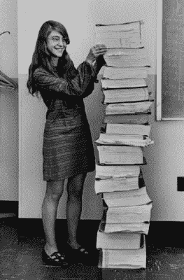

# 寻找第一条评论

> 原文：<https://hackaday.com/2021/10/23/in-search-of-the-first-comment/>

你是为人类还是为计算机写代码？我当时不在那里，但我猜在计算的黎明，人们认为他们是在为机器写作。毕竟，他们是用机器语言写的，无论他们输入电子大脑的是什么，都会留在电子大脑里，除非把它们打印在纸带上。命令让机器做事情，而不是其他人。代码是严格为计算机编写的。

另一方面，现代编程实践是坚定地针对人的。变量名和函数名选择得很长，以描述它们包含的内容或做的事情。代码的“可读性”是一个有价值的属性。事实上，有时它做了正确的事情这一事实似乎是事后才想到的。(我开玩笑！)

在这条道路的某处，有一个重要的进化步骤，就像第一条鱼用鳍状肢在陆地上行走。注释被集成到编程语言中，使过去的程序员在输入前手写在初稿页边的笔记正式化。所以我去寻找缺失的一环:第一种计算机语言，最好是第一个带有注释的程序。我空手而来。

或者更确切地说是满手。我能找到的每一种计算机语言从一开始就有注释。FORTRAN 有注释，用“C”作为一行的第一个字符。APL 有评论，标有奇怪的符文⍝.甚至为阿波罗 11 号制导计算机编写的自定义语言也有注释——现在已经司空见惯的“#”。我找不到没有注释的早期编程语言。

我的猜测是，第一种带有注释的语言一定是一种汇编语言，因为我不知道有任何机器带有本地注释指令。(那会有多酷多轻浮？)

汇编器只是简单地将助记符名称翻译成它们的机器指令对应物，但是这给了它们重要的自由，可以忽略任何以分号开头的东西。即使你只是将寄存器 X 的内容转移到寄存器 Y 中指向的内存位置，你也可以在注释中写下你正在“存储离地高度(米)”。

然而，关键的进化步骤是将注释与代码一起保存。简单地忽略分号后面的所有内容并扔掉它不算数。有人知道吗？第一个将注释作为代码本身的一部分而不仅仅是旁注的代码是什么？

This article is part of the Hackaday.com newsletter, delivered every seven days for each of the last 200+ weeks. It also includes our favorite articles from the last seven days that you can see on [the web version of the newsletter](https://mailchi.mp/hackaday.com/hackaday-newsletter-649368). Want this type of article to hit your inbox every Friday morning? [You should sign up](http://eepurl.com/gTMxQf)!