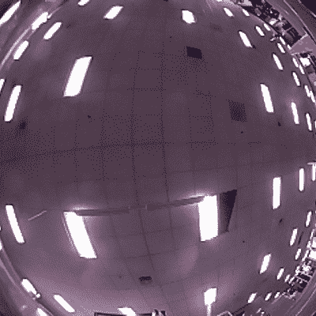

# 快速室内机器人观看天花板上的灯，而不是道路

> 原文：<https://hackaday.com/2021/10/25/fast-indoor-robot-watches-ceiling-lights-instead-of-the-road/>

[Andy]的机器人是一辆自动遥控汽车，他分享了他开发的定位算法来帮助汽车在室内赛道上疯狂行驶时保持自我跟踪。由于像这样的机器人完全有能力开得比它能感觉到的更快，他的定位方法是增加额外速度而不用担心汽车迷失自我的秘密。

The regular pattern of ceiling lights makes a good foundation for the system to localize itself.

为了实现这一点，[安迪]使用了一个带鱼眼镜头的摄像头对准天花板，视频在 Raspberry Pi 3 上处理。他的实现非常巧妙，只需要 1 毫秒就可以完成一次本地化更新，精度达到几厘米。这有点像一个快速的室内 GPS，使用数学根据天花板灯的移动来推断位置。

为了对比赛有用，这种定位方法需要结合赛道本身的地图，这是[Andy]通过在建立定位数据的同时手动驾驶汽车绕赛道行驶而巧妙地建立的。一旦安装到位，汽车就拥有了自主行驶所需的一切。

对本质细节感兴趣吗？你很幸运，因为上面链接的[项目页面](https://www.a1k0n.net/2021/01/22/indoor-localization.html)解释了【安迪】算法背后的所有数学，而[的 GitHub 知识库](https://github.com/a1k0n/cycloid/)中有【安迪】自动驾驶汽车的所有实现细节。

该系统是位置相关的，但它工作得如此之好，以至于[安迪]认为轨迹定位是一个已解决的问题。在下面嵌入的两个视频中观看该系统的运行。

第一段视频展示了比赛过程中摄像机的视角。

 [https://www.youtube.com/embed/tgfW2d5h_GI?version=3&rel=1&showsearch=0&showinfo=1&iv_load_policy=1&fs=1&hl=en-US&autohide=2&wmode=transparent](https://www.youtube.com/embed/tgfW2d5h_GI?version=3&rel=1&showsearch=0&showinfo=1&iv_load_policy=1&fs=1&hl=en-US&autohide=2&wmode=transparent)

第二个视频是鱼眼镜头视角经过修正后的样子，看起来就像是从前挡风玻璃往外看一样。

 [https://www.youtube.com/embed/3FvOCsjPew8?version=3&rel=1&showsearch=0&showinfo=1&iv_load_policy=1&fs=1&hl=en-US&autohide=2&wmode=transparent](https://www.youtube.com/embed/3FvOCsjPew8?version=3&rel=1&showsearch=0&showinfo=1&iv_load_policy=1&fs=1&hl=en-US&autohide=2&wmode=transparent)

小型赛车机器人的优势是不会受到碰撞的特别伤害，这是发生在实验性全尺寸自主赛车上更加尴尬的事情。