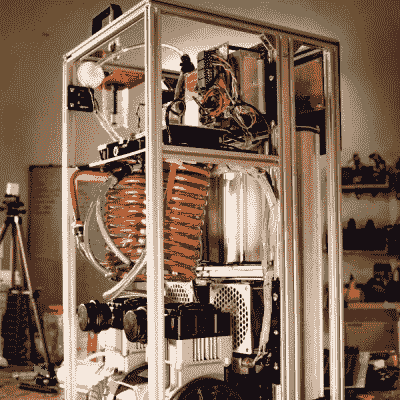
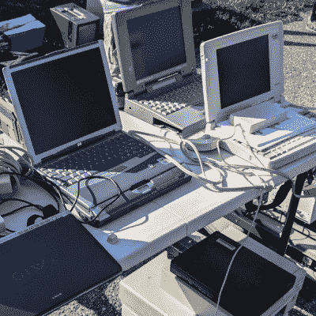
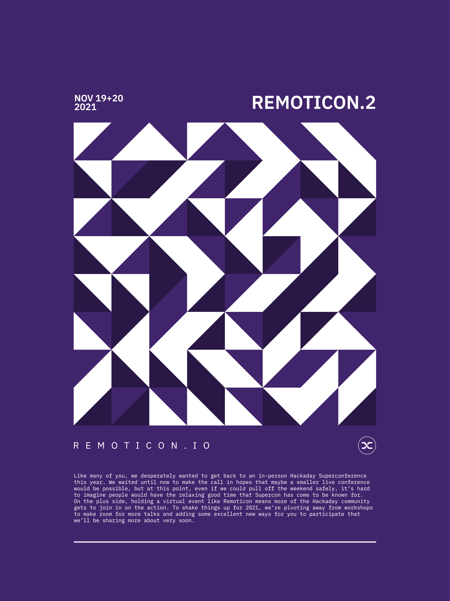

# 2021 年的 Remoticon 阵容中又增加了四场会谈

> 原文：<https://hackaday.com/2021/10/28/four-more-talks-added-to-the-2021-remoticon-lineup/>

我们已经公布了多位主题演讲人和一批迷人的演讲者，他们将展示从逆向工程老式计算器到为今年的 Remoticon 在您的 CAD 之旅中迈出第一步的一切。如果你认为这就是你将在会议上看到的一切，那也情有可原，但在 11 月 19 日为期两天的虚拟活动开始之前，还有很多东西要宣布。通常我们会承诺确保你花的钱物有所值，[但是由于门票是完全免费的](https://www.eventbrite.com/e/hackaday-remoticon-2021-tickets-172183193567?aff=talks20211027)，我们的目标要高一点。

在今年的延长电话会议期间，我们收到了大量精彩的谈话提议，让我们大吃一惊。让我们来看看接下来的四位演讲者，他们将参加 11 月 19 日至 20 日举行的 2021 年黑客日活动。

### 杰隆·多姆堡(又名[Sprite_tm])

**Rickrolling Buddha:深入逆向工程，彻底破解未知芯片**

 耶鲁安，作为传奇人物[Sprite_tm]而为黑客读者所熟知，是一个不会拒绝挑战的人。因此，当大克莱夫发布了一个来自廉价音乐佛教冥想辅助设备的 flash dump，并问他的观众是否有兴趣尝试弄清楚如何让该设备播放不同的歌曲时，他很乐意为此贡献自己的技能。

事实证明，耶鲁安和其他互联网侦探承担了这个难题，他们的工作已经完成了。从找出可怕的黑色环氧树脂块下隐藏着什么芯片到破解存储在 SPI 闪存芯片上的加密固件，该项目最终成为逆向工程的杰作。

虽然他们还没有达到他们的理想目标，即将里克·阿斯特利最热门的歌曲加载到这个小工具上，但耶鲁安认为他们已经很接近了，并将在一次精彩的演讲中告诉我们他们的进展。

### 塞尔吉·涅斯特伦科

**不要翻转我的比特:空间中的电子设备**

设计电子产品是困难的，当电子产品被建造来穿越太空时，这变得更加困难。Sergiy 在 SpaceX 的航空电子部门工作了五年，专门研究 EMI 和电离辐射效应，他学到了一两件事，即确保你的硬件拥有完成其任务的*正确材料*。

他的演讲是关于闪电、湿度、振动、摩擦带电、辐射、太阳耀斑、重返大气层等离子体和工程师在设计中必须考虑的其他一些物理问题的搭便车指南。换句话说，1000 种破坏电脑的方法。当我们使用开发板时，我们不会过多考虑这些问题，但是如果你希望将你的一个设计进行到底，这些事情会让你夜不能寐。

现在，Sergiy 领导着一家为 PCB(太空和其他)进行物理驱动的生成设计的初创公司，他将他的演讲描述为轻松的努力，使电子产品符合太空应用的要求，所以你不需要成为火箭科学家才能收听。但可能会有帮助。

### 瓦伊巴夫·查布拉

**M19 计划——开放式创新的一个案例&大规模分布式制造**
 如果说世界对新冠肺炎疫情的全球化毫无准备，那未免有些轻描淡写。似乎一夜之间，全球各地的社区都发现自己严重缺乏医院急需的个人防护设备。世界各地的制造商将此视为利用他们的技能和设备的机会，开始使用他们的 3D 打印机、激光切割机和 CNC 路由器生产从面罩到原型通风机的一切产品。

2020 年 3 月，印度的制造商联合起来成立了 M19 集体。着眼于将集中式开源设计理念与分散式制造相结合，他们能够在短短 49 天内生产出 100 万个面罩。最近，他们一直在关注印度的氧气短缺问题，不仅建造和分发浓缩器，还教育当地人如何操作和维护它们。

在他的演讲中，Vaibhav 将提供印度黑客和创客社区如何在这个前所未有的时代走到一起的第一手资料。随着草根层面的创新导致历史上可以说是最大规模的开源硬件采用，M19 集体在全球舞台上展示了协作开发的价值。

### 砷皮金斯

**笔记本电脑待办事项**

 可以肯定地说，大多数 Hackaday 的读者都有一两台旧笔记本电脑在工作间里游荡。你可能不会用它们，它们甚至可能不在工作状态，但是扔掉它们似乎是错误的。你知道它们充满了非常有用的部件，由于规模经济而小型化和廉价，但你如何确定哪些部件值得回收呢？也许更重要的是，一旦你解放了这些组件，你会怎么做呢？

对我们来说幸运的是，Arsenijs 专门为那些希望最大限度地利用办公桌下的旧笔记本电脑的黑客准备了一份演示文稿。在这次演讲中，他将重复使用显而易见的组件，如屏幕、键盘、充电器、主板、网络摄像头、电池和触摸板，但这只是冰山一角。那些旧机器里有用的设备比你想象的多得多，你只要知道要找什么就行了。

作为 Zerophone 的创造者，Arsenijs 非常了解移动设备。zero phone 是一款黑客友好型手机，组装价格为 50 美元。但是他重复使用回收零件的经验也来自于尝试在几乎没有预算的情况下将项目放在一起；我们都曾不得不处理的事情。他相信 Hackaday Remoticon 是一个完美的地方来展示他作为一个饥饿的黑客所学到的一些节俭的经验，我们也是如此。

## 我们还没完呢

还想吃吗？不要担心，在我们开始第二次远程会议之前可能只剩下三周了，但是当我们进入最后阶段时，我们仍然有更多的讲座和特别活动要展示。所以，帮你自己一个忙，把你的名字登记下来获得一张免费票，或者更好的是，[花 25 美元得到这件衬衫。毕竟，在我们开发出运输技术之前，这是你从虚拟活动中获得一些战利品的唯一途径。](https://hackaday.com/2021/10/04/hackaday-remoticon-tickets-and-t-shirts/)

