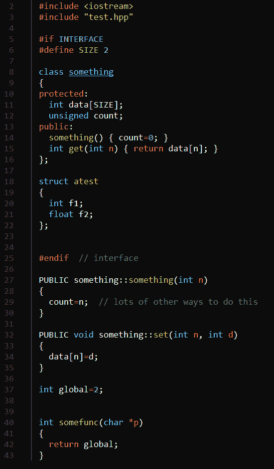
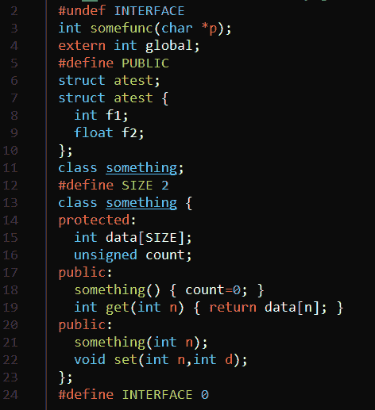

# Linux Fu:头文件自动生成

> 原文：<https://hackaday.com/2021/11/08/linux-fu-automatic-header-file-generation/>

我尝试了很多“较新”的语言，不知何故，当我回到 C++甚至 C 时，我总是最开心。然而，有一件事让我有点紧张:需要有一个带有声明的头文件，然后是一个复制几乎相同信息的单独文件。我经常做一些改变，但忘记更新标题，许多其他语言会帮你解决这个问题。所以我去寻找一种自动化的方法。当然，有些 ide 会自动插入声明，但是由于各种原因，我一直不太喜欢这样。我想要一些轻量级的东西，可以在许多不同的工具集中使用。

然而，我发现了一个更老的工具，它做得相当好，尽管有一些限制。这个工具似乎有点晦涩，所以我想我应该向你展示一下[做了什么 headers](https://fossil-scm.org/home/doc/trunk/src/makeheaders.html)—[Fossil](https://www.fossil-scm.org/home/doc/trunk/www/index.wiki)软件配置管理系统的一部分。这个程序可以追溯到 1993 年，当时[Dwayne Richard Hipp]——编写 SQLite 的同一个人——为了自己的使用而创建了它。它并不复杂——整个程序存在于一个相当大的 C 源文件中，但是它可以扫描一个目录并为所有内容创建头文件。在某些情况下，你不需要对你的源代码做大的改动，但是如果你愿意，你可以做几件事情。

## 问题是

假设你有两个合作的 C 文件。假设在 A 文件中有 A.c 和 B.c，有一个简单的函数:

```

double ctof(double c)
{
  return (9.0*c)/5+32.0;
}

```

如果您希望在文件 B 中使用它，那么需要有一个声明，这样当您编译 B 时，编译器可以知道该函数接受一个 double 参数并返回一个 double。对于 ANSI C(和 C++ ),您需要这样的东西:

```

double ctof(double c);

```

没有实际的编程，只是给编译器一个注释，告诉它函数是什么样子的。这就是你所谓的原型。通常，您将创建一个带有原型的头文件。您可以在 A.c .和 B.c .中包含该标题

问题是当你改变交流电的功能时:

```

double ctof(double c1, int double c2)
{
  return (9.0*(c1+c2))/5+32.0;
}

```

如果你不改变标题来匹配，你会有问题。不仅如此，你还需要做出同样的改变。如果你犯了一个错误，在头中将参数标记为 floats，那也不行。

## 该计划

假设你已经安装了软件，你可以简单地运行它，传递所有你想让它扫描的 C 和 H 文件。通常，glob *。[ch]会成功的。你也可以和一起使用。cpp 文件，甚至混合。默认情况下，这会将您定义的所有全局变量声明和全局函数拉入一系列头文件中。

为什么是连续剧？这个程序做了一个奇怪的假设，只要你仔细想想就明白了。因为头文件是自动生成的，所以重用头文件是没有意义的。相反，每个源文件都有自己定制的头文件。程序按照正确的顺序输入必要的内容。因此，A.c 将使用 A.h，B.c 将使用 B.h。这两个标头之间不会有任何交叉依赖。如果发生了变化，您只需再次运行程序来重新生成头文件。

## 什么会被复制？

下面是文档所说的被复制到头文件中的内容:

*   当函数在任何。c 文件中，该函数的原型放在生成的。每个的 h 文件。调用该函数的 c 文件。如果 C 的“static”关键字出现在函数定义的开头，则原型被抑制。如果您在通常会说“`static`”的地方使用了“`LOCAL`”关键字，那么就会生成一个原型，但是它只会出现在与包含该函数的源文件相对应的单个头文件中。然而，没有其他生成的头文件包含静态函数的原型，因为它只有文件范围。如果您使用“-local”命令行选项调用 makeheaders，那么它会将“`static`”关键字视为“【T3””，并在头文件中生成与包含函数定义的源文件相对应的原型。
*   在. c 文件中定义全局变量时，该变量的“`extern`”声明放在每个。使用该变量的 c 文件。
    当结构、联合或枚举声明或函数原型或 C++类声明出现在手动生成的。h 文件中，该声明被复制到自动生成的。所有的 h 文件。使用结构、联合、枚举、函数或类的 c 文件。但是出现在. c 文件中的声明被认为是私有的。不会被复制到任何自动生成的文件中。
*   手动生成的中出现的所有#defines 和 typedefs。h 文件被复制到自动生成的。h 文件。中出现的类似构造。c 文件被认为是这些文件的私有文件，不会被复制。当结构、联合或枚举声明出现在. h 文件中时，makeheaders 将自动生成一个 typedef，允许在没有“`struct`”、“`union`”或“`enum`”限定符的情况下引用该声明。

请注意，该工具可以判断它何时生成了一个头文件，因此您不必将它们从输入文件中排除。

## 一个 C++例子

对于像 C++类这样的东西——或者任何东西，真的——你可以在一个特殊的预处理器指令中包含一段代码，让工具处理它。这里有一个我用来测试的非常简单的例子:

[](https://hackaday.com/wp-content/uploads/2021/10/testcpp.png) 注意几件事。首先，test.hpp 的 include 将获取生成的特定于该文件的头文件。`INTERFACE`指令包装了应该在头中的代码。在编译时，`INTERFACE`将等于零，所以这段代码不会编译两次。

在`INTERFACE`部分之外声明的成员函数前面有`PUBLIC`(当然，也可以有`PRIVATE`或`PROTECTED`)。这将导致工具拾取它们。最后，注意在文件的底部有一个全局变量和一个全局函数。

注意，当使用`PUBLIC`或其他关键字时，您从声明中省略了函数。这个例子有一些函数的唯一原因是因为它们是内联的。如果将所有函数放在文件的接口部分之外，生成的头文件将正确组装类声明。在这种情况下，它会将这些函数添加到已经存在的函数中。

## 生成的标题

标题看起来很正常。您可能会感到惊讶，头文件没有用通常的预处理器语句来包装，以防止文件被多次包含。毕竟，由于只有一个文件会包含头文件，所以这些代码是不必要的。

这是文件:

[](https://hackaday.com/wp-content/uploads/2021/10/testhpp.png) 注意`INTERFACE`在最后被设置为零，这意味着在源文件中，接口部分不会被再次编译。对于 C 源代码，该工具还为结构之类的东西生成 typedefs。当然，对于 C++来说，这是不必要的。您可以看到在接口部分和实现部分有一些声明的副产品:有一个多余的公共标签。这是无害的，如果我将所有代码都放在接口部分之外，就不会出现这种情况。

## 还有更多

这个多功能工具还可以做更多的事情，但是您可以阅读文档。有一个标志转储关于您的代码的信息，您可以将其用于文档目的。您可以构建接口的层次结构。它还可以帮助你混合 C++和 C 代码。该工具足够智能，可以处理条件编译。但是请注意，C++支持不处理模板和名称空间之类的东西。不过，您有源代码，所以如果您愿意，您可以修改它。在大型项目中采用这种方法之前，您应该了解一些其他的限制。

你会尝试这样的工具吗？或者你喜欢手动处理标题吗？C++甚至可以[针对网页](https://hackaday.com/2020/12/21/c-compiler-targets-the-web/)。或者，如果你敢的话，把它用于 [shell 脚本](https://hackaday.com/2019/09/17/linux-fu-shell-scripts-in-c-c-and-others/)。