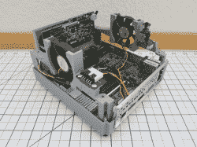

# GamecubePC 在 GameCube 塑料中加入了大量的功能

> 原文：<https://hackaday.com/2021/10/28/gamecubepc-packs-plenty-of-punch-into-gamecube-plastics/>

如果说阅读 Hackaday 教会了我们什么的话，那就是有一部分黑客比大多数人在模拟器构建方面走得更远。[RetroModder]显然就是这样一个黑客。进入 [GamecubePC，你可以在 Hackaday.io](https://hackaday.io/project/181853-gamecubepc) 上读到。GamecubePC 是一个多年的项目，旨在将整个 Windows 10 PC 塞进 GameCube 外壳，同时仍然能够以原生分辨率和性能玩 Wii 和 GameCube 游戏。

Internals of the GamecubePC with all the custom chassis and PCB’s on display

虽然制作一个 GameCube 和 Wii 模拟器只需要一台备用电脑和 Dolphin 模拟器，但人们已经非常注意让 GameCube 保持在最前沿。造成这种错觉的原因是，通过定制 PCB 将部件连接到 mSTX 主板，保留了原来的 GameCube 电源开关和复位按钮。

GameCube 外壳的底部被一个 3D 打印的底座取代，它可以安装主板，同时智能地提供对主板前面板的访问。这款微型主板采用英特尔酷睿 i5-7600 处理器，配有 8GB 内存和固态硬盘存储。最重要的是四个功能控制器端口，可以切换到模拟器或 PC 游戏上使用。毫无疑问，GamecubePC 将会成为许多双摄的主题！

定制游戏对 Hackaday 来说并不陌生，你可能会喜欢这个可以玩 Wii 和 GameCube 游戏的[便携式 Wii 或者这个被黑进任天堂 Switch](https://hackaday.com/2019/06/09/a-wii-playing-the-gamecube-disguised-as-a-game-boy-sp/) 的 Joycon 的 [GameCube 控制器。](https://hackaday.com/2020/01/13/finally-a-real-set-of-gamecube-joycons/)