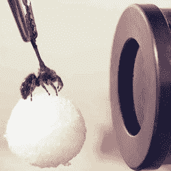

# 眼球追踪装置是跳蛛的微型电影院

> 原文：<https://hackaday.com/2021/10/28/eye-tracking-device-is-a-tiny-movie-theatre-for-jumping-spiders/>

眼睛是心灵的窗户，这项研究探讨了跳蛛在看什么，以及为什么需要一个聪明的设备来执行眼睛跟踪，但对于跳蛛来说。这些迷人生物的视力在某些方面与人类有很多相似之处。我们都感知到一个较低视觉保真度的广角区域，但能够将我们的注意力引向其中感兴趣的区域，以看到更多细节。研究人员已经能够对跳蛛进行眼球追踪，在一种有点像微型电影院的定制设备的帮助下，实时准确地显示它们正在看的地方。

A harmless temporary adhesive on top (and a foam ball for a perch) holds a spider in front of a micro movie projector and IR camera. Spiders were not harmed in the research.

为了做到这一点，研究人员必须变得聪明。蜘蛛两只朝前的主眼的不眨的晶状体不会移动。相反，为了看不同的东西，眼睛内部的锥形被肌肉移动。这有效地将视网膜拉向不同的感兴趣区域。蜘蛛的主要眼睛有回飞镖形状的视网膜，有一个 X 形的高分辨率视觉区域，蜘蛛根据需要指引方向。

那么蜘蛛眼跟踪器是如何工作的呢？蜘蛛栖息在一个微小的泡沫球上，并附着在一根小刚毛上，这是借助一种基于蜂蜡的无害的临时粘合剂实现的。以这种方式，蜘蛛被稳定地保持在视频屏幕的前面，而不会受到限制。当红外摄像机从蜘蛛两只主要眼睛内的视网膜上捕捉到红外反射时，蜘蛛就会看到家庭电影。通过将红外反射叠加到显示的视频上，就有可能在任何给定的时刻准确地看到蜘蛛在看什么。这在某些方面类似于[对人类进行眼球追踪的方式](https://hackaday.com/2018/05/05/low-cost-eye-tracking-with-webcams-and-open-source-software/)，后者也使用红外线，但观察瞳孔的位置。

在下面嵌入的短视频中，如果你仔细看，你可以看到两个视网膜形成了一个 X 形，颜色比背景的其他部分略浅。观察蜘蛛发现并专注于美味蟋蟀的轮廓，但当一个黑色的椭圆形出现并变大时(如果它越来越近，它会看起来越来越大)，蜘蛛的目光会迅速转向潜在的威胁。

觉得有必要了解更多关于跳蛛的知识？这项眼球追踪研究是一篇更大的科学新闻文章的一部分，突出了这些迷人生物栖息的深层感官光谱，其中大部分人类完全无法接触到。

 [https://www.youtube.com/embed/zFgw8BjKZ6U?version=3&rel=1&showsearch=0&showinfo=1&iv_load_policy=1&fs=1&hl=en-US&autohide=2&wmode=transparent](https://www.youtube.com/embed/zFgw8BjKZ6U?version=3&rel=1&showsearch=0&showinfo=1&iv_load_policy=1&fs=1&hl=en-US&autohide=2&wmode=transparent)

