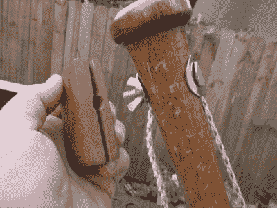

# 路易斯维尔强击手将低音放在垒上

> 原文：<https://hackaday.com/2021/11/06/louisville-slugger-puts-this-bass-on-base/>

壶乐队和美国民间音乐中最著名的乐器之一是洗衣盆贝斯。也被称为 gutbuckets，这些乐器倾向于使用一个旧扫帚作为琴颈，通常只有一根弦。

 我们会说[【守门员】的单弦双桶](https://www.instructables.com/Single-String-Double-Gutbucket/)的设计也要归功于小提琴家族的低音提琴，它的数字 8 形状。在这些浴缸的顶部是一个胶合板共鸣板，它被拧入浴缸边缘周围的一系列木块中。

对于琴颈和指板的组合，[goaly]调用了一个老式的路易斯维尔球棒，这比一些旧的扫帚柄有趣得多。[goaly]用长度为 2”x2”的碎片将脊柱延伸穿过身体，这个脊柱贯穿两个浴盆，充当底部的钉子。绳子被绑在一块木板上，玩家用脚将木板固定住，以代替系弦。

虽然[goaly]首先试验了钢缆、晾衣绳、尼龙绳和降落伞，但绳子是由 weed whacker trimmer line 制成的。在顶部，绳子通过颈部连接——用几个弯曲的挡泥板垫圈压住，用蝶形螺母拉紧。我们喜欢[goaly]甚至制作了一个木制工具，以便于转动蝶形螺母。我们也喜欢 DIY 桥，它看起来像一个小人。

有几种方法可以让这个东西发出声音。当然，微动和拨弦是有效的，但是向后弯曲整个东西来改变音高也是有效的。要想玩得开心，两样都做。我们认为它听起来很棒，甚至在前面和后面都能发出很棒的敲击声。休息之后，请查看实际情况。

没有洗衣盆？手推车也可以工作，它有自己的支架。

 [https://www.youtube.com/embed/8daFjJ8faUU?version=3&rel=1&showsearch=0&showinfo=1&iv_load_policy=1&fs=1&hl=en-US&autohide=2&wmode=transparent](https://www.youtube.com/embed/8daFjJ8faUU?version=3&rel=1&showsearch=0&showinfo=1&iv_load_policy=1&fs=1&hl=en-US&autohide=2&wmode=transparent)

