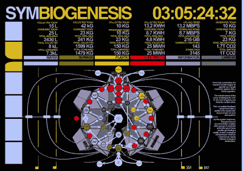

# 新陈代谢者现在变废为宝的速度更快了

> 原文：<https://hackaday.com/2021/11/05/the-metabolizer-is-turning-trash-into-treasure-even-faster-now/>

你还记得几年前[萨姆·史密斯]的代谢者吗？如果你已经忘记了，[这个宝贝把垃圾变成打印的塑料物品](https://hackaday.io/project/139958-the-metabolizer)，而且它是太阳能驱动的。虽然代谢者没有获得 2018 年的 Hackaday 奖，但那一年[Sam]和他的机器获得了很多成就，包括开放硬件挑战。看到这个项目仍在改进真是太棒了。

 概括一下，阳光照射到太阳能电池板上，给电池组充电。一旦有足够的能量启动反应，它就会被倒入一个加热元件，将生物质转化为生物炭。这些烟雾被冷却、收集、提炼，并被送入一个小型气体发生器，该气体发生器产生 DC 动力来驱动一台 3/4 马力的碎纸机和垃圾打印机。

[Sam]将这种野兽比作 Rube Goldberg 机器，因为它执行过于复杂的连锁反应来完成简单的任务。我们当然明白他的观点，但我们认为这台机器比那些经典的机器更有价值，经典的机器往往做不了任何有用的事情，而且往往在这个过程中消耗许多资源。相反，代谢者的连锁反应从阳光开始，以有用的物体结束，使塑料远离垃圾填埋场。老实说，这更像是一堆堆肥，上面有一个生物学博士，一把类固醇和一台 3D 打印机。

不幸的是，[Sam]无法及时制作出原型来领奖，在 1000 美元用完之后，他转向[pat reon](https://www.patreon.com/disruptivelyuseful)寻求支持。三年后，经过大量的改进，[Sam]有了一个更便宜、更高效、更容易制造的工作原型。但是，除了[Sam]之外，其他人能相对容易地构建它吗？[考虑下](https://www.metabolizer.org/)的战书。

对你的标准堆肥堆不满意？你需要一个 DIY 滚筒筛来筛出不好的东西。