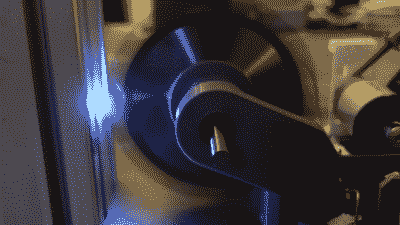

# 战斗机器人使用碳纤维减轻重量

> 原文：<https://hackaday.com/2021/11/05/battle-robot-uses-carbon-fiber-to-save-weight/>

ZAP! The saw is capable of delivering high-voltage discharges to damage its foes.

战斗机器人有各种形状和大小，监管当局经常使用重量限制来为竞争对手创造公平的竞争环境。[Hans jrgen grim stad]正在制造一个机器人参加 4 公斤级比赛，并为此做出了一些有趣的设计决定。

4 公斤并不是一个可以玩的重量。当考虑到推进机器人所需的电机和运行一切所需的电池时，武器系统和装甲板的重量就所剩无几了。

因此，为了最大限度地利用重量限制，[汉斯]决定使用碳纤维作为机器人的外壳。使用的方法是在模具中简单的湿铺层。我们非常有兴趣看看这种装甲在竞争中的表现，与铝和钢等更典型的选择相比。

其他有趣的功能包括一个皮带驱动锯，汉斯用手在几英寸远的地方测试，机器人的马达已经启动。如果你重视你的手指，就不要这样做。这与高压放电泰瑟枪模块配对。当锯子靠近另一个机器人时，它可能会导致火花跳到敌人身上，在这个过程中损坏它的电子设备。这是我们不常见到的事情，因为这样的措施实际上在一些比赛中是被禁止的。

战斗机器人社区的铁杆爱好者可能会对设计的许多方面有激烈的意见；请在评论中表达出来。这当然不是第一个碳纤维机器人，但很高兴看到这种花哨的材料被扔进戒指。

我们也看到了其他设计师的创新，比如这个非常成功的步行机器人。休息后的视频。

 [https://www.youtube.com/embed/bmFdi5rW4lo?version=3&rel=1&showsearch=0&showinfo=1&iv_load_policy=1&fs=1&hl=en-US&autohide=2&wmode=transparent](https://www.youtube.com/embed/bmFdi5rW4lo?version=3&rel=1&showsearch=0&showinfo=1&iv_load_policy=1&fs=1&hl=en-US&autohide=2&wmode=transparent)

