# Pi Zero 2 W 是效率最高的 Pi

> 原文：<https://hackaday.com/2021/11/01/the-pi-zero-2-w-is-the-most-efficient-pi/>

上周我们看到了[新的 Raspberry Pi Zero 2 W](https://www.raspberrypi.com/news/new-raspberry-pi-zero-2-w-2/) 的发布，这基本上是 Pi Zero 的一个改进的四核版本——在速度上与 Pi 3B+更具可比性，但外形尺寸更小。该板的一个显著特点是 Raspberry 设计的 RP3A0 系统级封装，它在同一芯片上集成了 4 个 CPU 和 512 MB RAM。虽然以今天的标准来看，512 MB 的内存并不算贵，但它在 T2 是可行的。但这种定制芯片有一个秘密:它让电路板以合理的低功耗运行。

当你使用 Pi Zero 时，很可能你正在做一个小项目，甚至可能是一个用电池运行的项目。旧的 Pi Zero 非常适合这些独立的、可能是无头的嵌入式项目:慢慢地啜饮毫安。但是它的代价是计算速度比它的兄弟们慢得多。这就是 Pi Zero 2 W 试图填补的空白。它能成功吗？它能跑得更快，而不消耗电池吗？Raspberry Pi 给 Hackaday 发了一个评论单元，我整个周末都在浏览这个单元。我们将看到一些基准，测量功耗，并了解新主板的表现。

答案竟然是一个合格的“是”。如果你看看混合的 CPU 和内存任务，RP3A0 的额外效率使 Pi Zero 2 W 的运行速度比我们测试的任何其他覆盆子主板都快。大多数时候，它运行起来几乎像一个树莓派 3B+，但使用更少的电力。

在这个过程中，我们发现了一些关于 Raspberry Pi 功耗的有趣模式。事实上，这篇文章的 clickbait 标题可以是“我们在 Raspberry Pis 内联焊接了一个电阻，你不会相信接下来发生了什么”，只不过这不是真正的 clickbait。当*关闭*时，你认为树莓 Pi 4B 消耗多少毫安？你不会相信的。

## 测试性能和功耗

当谈到选择一台微型 Linux 计算机嵌入到你的项目中时，与几年前相比，现在你有了更多的选择。即使你打算呆在舒适的覆盆子 Pi 电脑世界里，你也在看更老的 [Pi 3B+](https://hackaday.com/2016/02/28/introducing-the-raspberry-pi-3/) ，小的 [Pi Zero](https://hackaday.com/2017/02/28/10-raspberry-pi-zero-w-the-w-means-wifi-bluetooth/) ，各种配置的强大 Pi 4B，以及上周的 [Pi Zero 2 W](https://hackaday.com/2021/10/27/new-raspberry-pi-zero-2-upgrades-to-quad-core-processor/) 。

我对所有的树莓进行了两次相当标准的折磨测试，同时连接到一个串联有 0.100ω精密电阻的电源，并记录了电阻两端的压降，从而记录了计算机消耗的电流。这里的值是我的示波器在 50 秒内取的平均值，它精确地计算了电流中的短尖峰，同时提供了良好的长期平均值。所有的 pi 都是无头运行的，通过 WiFi 和 SSH 连接，除了 USB 电源，没有其他电线进出。因此，这些是使用 WiFi 的 Pi 的最低数字——如果您运行 USB 外设，不要忘记将它们纳入您的电力预算。

[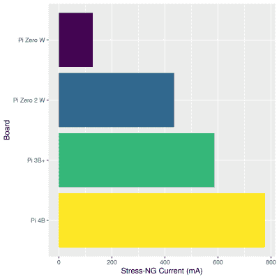](https://hackaday.com/wp-content/uploads/2021/10/Stress.NG_.Current.png) 第一个测试是`stress-ng`，它只是用矩阵求逆问题敲打所有可用的 CPU 核心。这对于承受热应力的计算机来说很棒，但对于测试它们的最大 CPU 驱动功耗来说也是如此。这里所有的 Pi 都有四个内核，除了最初的 Pi Zero 只有一个内核。你可以看到，随着 CPU 能力的提升，你会消耗更多的电子。Pi Zero 2 有四个内核，但运行速度为 1 GHz，而 3B+的运行速度为 1.4 GHz，4B 的运行速度为 1.5 GHz。更多的计算，更多的能力。

第二项测试是 [sbc-bench](https://github.com/ThomasKaiser/sbc-bench) ，包括内存带宽测试(tinymemtest)、混合使用 CPU 基准测试(7-zip)和加密加速测试(OpenSSL)。不幸的是，没有一个 Raspberry Pis 使用硬件加密加速，所以 OpenSSL 测试最终几乎与 7-zip 测试相同，这是一个混合 CPU 和内存能力的测试，为了节省空间，我在这里跳过了结果。

为了便于解释，我使用两个内存子测试的总和作为 TinyMemBench 的结果，7-zip 测试结果是三次运行的平均值。对于所有这些，数字越大越好:内存写得越快，压缩的文件越多。这就是事情变得有趣的地方。

首先看看内存带宽得分，4B 遥遥领先，旧的 Pi Zero 落后，但 3B+和 Zero 2 基本上并驾齐驱。然而，有趣的是在记忆测试中使用的能量。零 2 W 的得分明显优于 3B+和 4B。它只是更有效，虽然如果你除以得到每瓦特功率的内存带宽，旧的 Pi 零脱颖而出。

[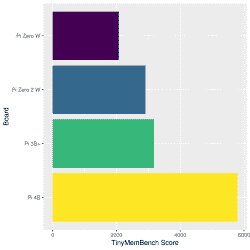](https://hackaday.com/tinymembench-score/)

More megabits per second is better

[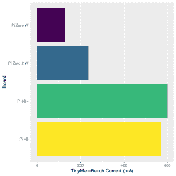](https://hackaday.com/tinymembench-current/)

At the cost of more power

[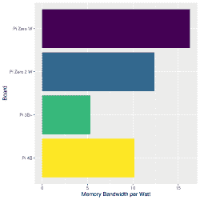](https://hackaday.com/memory_per_watt/)

The Pi Zero is surprisingly efficient with memory

然后转向 7-zip 测试，一个通用计算的代理。同样，四核 Pi 的性能明显优于小 Pi Zero。Pi 4 是迄今为止最快的，如果冷却得当，它可以被推至荒谬的性能。但是，正如任何使用过树莓 Pi 和电池的人都知道的那样，更大尺寸的树莓 Pi 电脑在完成工作时会消耗更多的能量。

但是看看圆周率零点 2 的性能和圆周率 3B+之间的差距。他们非常接近！从用电量的角度来看，差距也是巨大的。这是 Pi Zero 2 最大的卖点。几乎 3B+的计算性能，而使用的功率仅略高于旧的 Pi Zero。如果将这两个结果相除，得到每瓦特压缩文件的数量，我称之为每瓦特计算“咕噜声”, Zero 2 遥遥领先。

[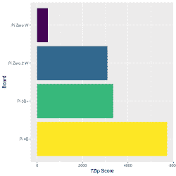](https://hackaday.com/7zip-score/)

Almost as fast as the Pi 3B+

[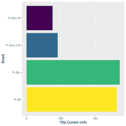](https://hackaday.com/7zip-current/)

With a lot less power used.

[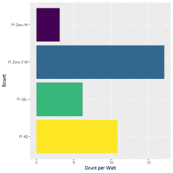](https://hackaday.com/grunt_per_watt/)

Pi Zero 2 W is outstandingly efficient

如果你正在寻找一个便携式项目中缓慢的 Raspberry Pi Zero 的替代品，那么 Pi Zero 2 看起来确实非常符合要求。

## 闲置电流和僵尸电流

一些项目只需要做一点点工作，然后可以在不活动时关闭或减慢速度，以减少一天中的总功耗。着眼于节能，我查看了所有主板在不工作时的表现，其中一个答案非常令人惊讶。

[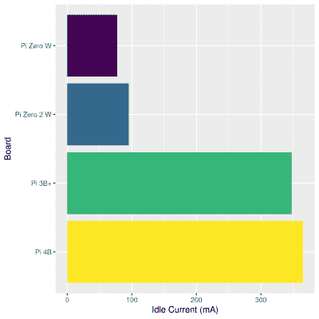](https://hackaday.com/wp-content/uploads/2021/10/idle_current-1.png) 除非你在树莓 Pi 上处理严肃的数字或运行繁忙的网络服务器，否则它大部分时间都可能处于空闲状态，其空闲电流消耗实际上将主导总功耗。在这里，我们可以看到 Pi Zero 2 与旧的 Pi Zero 相比与其他两个板有更多的共同点。除了保持 WiFi 运行外，零的耗电量还不到比它们大的兄弟姐妹的三分之一。这是一件大事。

我还想研究一下，如果你可以关闭 WiFi，或者完全关闭系统，类似于我们一直在较小的微控制器上使用的省电技巧，会发生什么。为了测试这一点，我在空闲状态下运行了一个例程，关闭 WiFi，等待 10 秒钟，然后关闭系统。我对两件事感到惊讶。第一，WiFi 在待机状态下消耗的电量并不显著——你可以看到它在空闲阶段周期性地激活。

第二，关闭系统的电流消耗在各方面有很大差异。我把这种电流称为“僵尸电流”，因为这是当 CPU 大脑完全关闭时，电路板产生的电流。为了绝对确定我测量的僵尸电流是正确的，我在关机后大约十秒钟拔掉了电路板。这些是你在这里看到的，为每个系统绘制的轨迹。有四个阶段:空闲，没有 WiFi 的空闲，关机/僵尸，最后物理拔掉插头。

[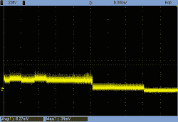](https://hackaday.com/pi_zero_zombie/)

Pi Zero

[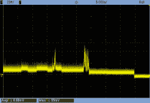](https://hackaday.com/pi_zero_2_zombie/)

Pi Zero 2

[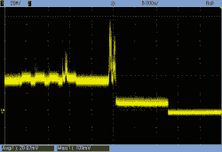](https://hackaday.com/pi_3b_zombie/)

Pi 3B+

[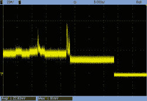](https://hackaday.com/pi_4b_zombie/)

Pi 4B

[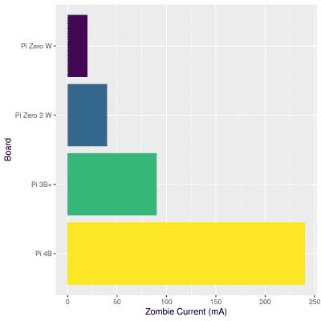](https://hackaday.com/wp-content/uploads/2021/10/zombie_current.png)Pi 4 关断时消耗 240 mA 左右，即 1.2 W！Pi 3 的功耗约为 90 mA，即 0.45 W。相比之下，Pi Zero 2 的空闲电流与 Pi 3 的僵尸电流相似。Pi Zero 2 有一个更接近于忽略不计的 45 mA 僵尸抽取，而原来的 Pi Zero 抽取更少。

这里的要点是，虽然对于更强大的 CPU，空闲所需的功率会增加并不奇怪，但空闲和僵尸电流的变化程度实际上决定了在电池供电的项目中使用哪些电路板。小心！

## 规模和力量并不代表一切

在这方面，由于 Pi 3B 的处理能力，明显更好的电源管理，以及一半的价格，树莓 Pi Zero 2 W 对于任何需要啜饮果汁但也需要包装一些潘趣酒的人来说都具有难以置信的吸引力。旧的 Pi Zero 在小型无头项目中大放异彩，它是电池驱动项目的唯一真正选择。Pi Zero 2 看起来绝对是一个有价值的继任者，增加了更多的 CPU 能力，而不是那么多的电力。

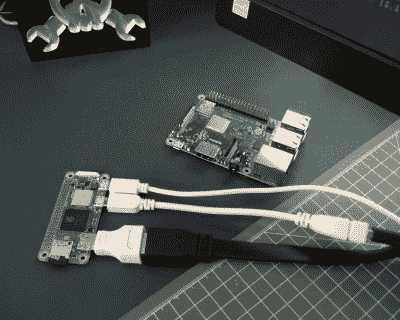

尽管如此，我不认为 Pi Zero 2 会取代其最接近的竞争对手 3B+，原因很简单，Pi 3 的内存更大，开箱后的连接功能更丰富。如果您的项目涉及多个 USB 设备、有线以太网或“普通”HDMI 连接，添加所有这些额外的部件会使零基础设置几乎与 b 一样庞大，当它归结为纯粹的咕哝声、该死的功率预算时，Pi 4 显然仍然是赢家。

但是通过将四个核心与片上内存紧密结合，树莓 Pi Zero 2 W 绝对是最节能的 Pi。