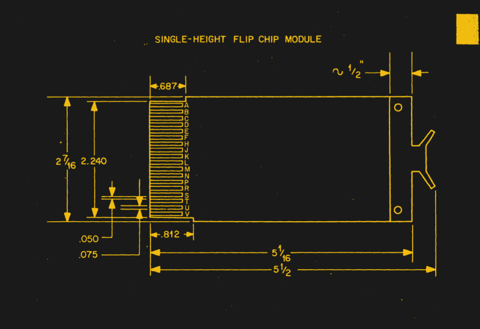

# 倒装芯片 KiCad 模板

> 原文：<https://hackaday.com/2021/11/07/flip-chip-kicad-templates/>

我们喜欢逆向计算，我们喜欢允许简单项目共享的开源标准。复古 DEC 电脑爱好者[Jay Logue]在他最近的 GitHub 项目中将这两者结合起来，在那里他分享了几个用于制作自己的倒装芯片模块的 KiCad 模板。尽管以我们今天熟悉的半导体封装技术命名，DEC 倒装芯片在 1964 年作为模块化电子封装系统推出。从 1965 年的 PDP-8 开始，DEC 的许多可编程数据处理器(PDP)计算机都采用了这些技术。DEC 还有一个数字实验室模块系列，这是一个自己定制的电子系统。 [1968 年数字逻辑手册](http://www.bitsavers.org/pdf/dec/handbooks/Digital_Logic_Handbook_1968.pdf)展示了可用的模块，并具有六年后出现的 [TTL 烹饪书](https://www.tinaja.com/ebooks/TTLCB1.pdf)的外观和感觉。

这些年来，倒装芯片有各种尺寸:单、双、四、六边形板，有标准长度和扩展长度。PCB 的一边有 18 个镀金的手指，后来扩展到 36 个双面手指，插入背板。互连通常是绕线的。单一高度的主板为 127 x 62 毫米(5 x 2-7/16 英寸),一端带有带标签的抽取器支架。[Jay]的存储库中有五种最流行的变体的模板，使用这些模板作为起点，制作其他尺寸应该很简单。

虽然如今我们在类似尺寸的电路板中封装了更多的功能，但许多系统仍然使用模块化设计，这与 50 多年前的倒装芯片没有什么不同。你还记得使用倒装芯片吗，或者你今天还在使用它们吗？请在下面的评论中告诉我们。