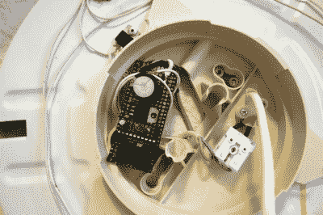

# 微小的唤醒灯非常亮

> 原文：<https://hackaday.com/2021/11/06/tiny-wake-up-light-is-hugely-bright/>

让我们面对现实吧——无论在一年中的什么时候醒来都是艰难的。但是秋天和冬天的黑暗让情况变得更糟。过去，[Maarten]一直使用音量越来越大的音乐，但根据设置的不同，如果你想每天听到不同的歌曲，并且没有对所有文件进行音量调节，这可能会有问题。

[Wake Up Bright](https://www.geekabit.nl/projects/wake-up-bright/) 是【Maarten】制造的一系列唤醒小工具中的最新一款，帮助人们在早上醒来。他们的文章涵盖了他们多年来对这个主题的所有想法，以及电子产品、固件、调试和使用一段时间后进行的所有升级。

 慢慢变亮 LED 不一定很难也不一定很贵。[Maarten]最初使用 Atmel 90S2313 AVR，后来升级到 ATtiny 2313，这很容易，因为两者引脚兼容。2313 输出 PWM，它使 LED 占空比产生一种良好的白光淡入，比 20 世纪 80 年代经典的闹钟蜂鸣声柔和得多。

随着时间的推移，这个项目从一个宜家围栏转移到另一个围栏。我们真的很喜欢新的那个，它看起来像是为人们设计来黑进一个唤醒灯的。

我们的眼睛感知亮度以对数方式增加，但 PWM 是线性的。我们可以通过不时地将 PWM 值乘以某个因子来解决这个问题，但问题是这个 AVR 从未学习过它的乘法表。那怎么做呢？[Maarten]的答案是使用 16 位寄存器进行字节移位——一个字节用于 PWM，另一个字节作为暂存区进行对数运算。[Maarten]每隔几秒钟将 16 位寄存器乘以 1/256，导致亮度呈对数增长。它是为 15 分钟的日出计算的，这需要一些实验才能正确。

虽然[Maarten]最初使用的是 3 W RGB LED，但当前版本有 3 个 10 W LEDs，并使用旧显示器的电源。美国的夏令时即将结束，而且会很快变得更糟。幸运的是，这个项目是完全开源的固件。

你认为 20 世纪 80 年代的闹钟哔哔声不好吗？[反复打几个耳光清醒一下怎么样？](https://hackaday.com/2015/12/29/simone-does-strange-things-with-motors-and-servos/)