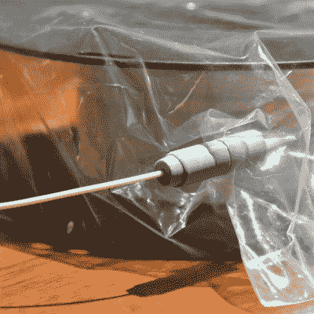

# 这个 0 美元的灯丝干燥箱几乎不需要任何零件

> 原文：<https://hackaday.com/2021/11/09/this-0-filament-drybox-needs-nearly-no-parts/>

所有 3D 打印机灯丝都受益于尽可能保持干燥，但有些灯丝比其他灯丝对湿度更敏感。最好的解决方案是一个干燥箱；一种密封的细丝容器，通常内部装有干燥剂。但在紧要关头，[【space fan】的快速肮脏的 0 美元干箱解决方案](https://www.prusaprinters.org/prints/85378-0-filament-dry-box)至少在简单性方面是鼓舞人心的。

The only added part is this 3D-printed fitting.

[Spacefan]的解决方案使用细丝卷自身的包装材料和单个 3D 打印部件为单个卷创建密封环境。该卷生活在一个塑料袋中(可能是密封的那个)，细丝通过一个小孔和 3D 打印的配件离开，该配件也使用了一点备用的聚四氟乙烯管。这个盒子兼作所有东西的方便容器。它不像另一个 DIY drybox 解决方案提供那么多，但肯定很简单。

虽然我们很欣赏这个想法，但这种设计肯定会给线轴本身带来很多摩擦。将细丝从线轴上拉下来需要做很多额外的工作，这需要在袋子里、盒子里转动，这些额外的工作将由 3D 打印机的挤出机完成，这是一个理想情况下应该尽可能少工作的部分。材料的再利用是一个伟大的想法，但在我们看来，这个想法需要一些改进。

你怎么想呢?紧要关头有用，还是需要改变？增加一个主轴来支撑线轴会有帮助吗？请在评论中告诉我们你的想法。