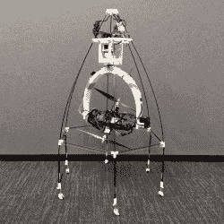

# 万向全旋翼飞机越过巨大障碍

> 原文：<https://hackaday.com/2021/11/13/gimballed-omnirotor-goes-over-great-obstacles/>

什么东西可以在地面上行驶，在空中跳跃，并连续移动其同轴转子组件，而无需重置其位置？答案是【新灵巧】的[全旋翼全地形平台](https://hackaday.io/project/181977-omnirotor-an-agile-coaxial-all-terrain-vehicle)。

虽然仍然是一个原型，但下面的视频显示，Omnirotor 声称的灵活性不只是一个炒作。通过同轴转子配置，可以相对轻松地穿过、绕过和越过障碍物，这肯定会让一些人兴奋不已。

Omnirotor’s unique design lends to its agility

虽然在每个方面都不新颖，但 Omnirotor 的优势来自于相当独特的功能组合。同轴转子是完全万向的，因此可以从任何方向移动到任何方向。换句话说，它可以在任何轴上无限旋转，而不需要回到原位。这种魔力的一部分来自于对资源的巧妙利用:电池、速度控制器和马达都是一体的。这种巧妙的方法避免了需要大而重的滑环，否则将需要传输功率。

增加 Omnirotor 灵活性的是一组轮子，允许飞行器沿着表面推进，大概是为了减少能量消耗。如果一个障碍物太难绕过或越过怎么办？全旋翼飞机飞到空中并飞越它。同轴转子被装在笼子里，保护它们免受你在近距离内预期的典型的转子卡住危险。

[新灵巧]已经开源了整个项目，在 Github 上提供了 [Omirotor 设计](https://github.com/newdexterity/OmniRotor)、[固件](https://github.com/JBuzzatto/Omnirotor_Firmware)，甚至还有[基准测试平台](https://github.com/newdexterity/Coaxial-Benchmarking-Platform)，以便其他人可以分享乐趣，并进一步迭代设计。

你可能还会喜欢这个基于四面体的[全旋翼](https://hackaday.com/2021/01/09/six-degrees-of-freedom-omnicopter-with-ardupilot/)，或者另一个知道如何玩捡球的[全旋翼。真的。](https://hackaday.com/2017/05/28/a-flying-fetching-helping-hand-omnicopter/)

 [https://www.youtube.com/embed/JN7Ji_fr_0w?version=3&rel=1&showsearch=0&showinfo=1&iv_load_policy=1&fs=1&hl=en-US&autohide=2&wmode=transparent](https://www.youtube.com/embed/JN7Ji_fr_0w?version=3&rel=1&showsearch=0&showinfo=1&iv_load_policy=1&fs=1&hl=en-US&autohide=2&wmode=transparent)

[hack adayprize 2021](https://prize.supplyframe.com)主办单位: