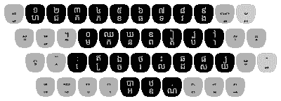
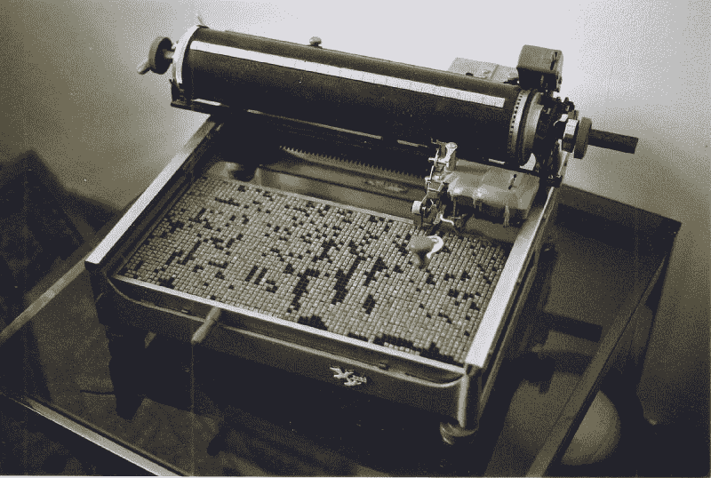

# 但是想想(全球)用户！

> 原文：<https://hackaday.com/2021/11/29/but-think-of-the-world-wide-users/>

历史上充满了关于技术的故事，这些技术对设计者来说是有意义的，但并不真正符合用户的需求。拿蛋糕粉来说。1929 年，一个名叫达夫的人意识到他可以利用剩余的面粉和糖蜜，创造出一种蛋糕混合料。你只需在干混合物中加水，然后烘烤，就能做出美味的蛋糕。第二次世界大战后，通用磨坊和皮尔斯伯里也想卖更多的面粉，所以他们开始做蛋糕。但是销售额持平了。一位名叫狄克特的心理学家是焦点小组的先驱，他给出了答案:面包师并不觉得他们对蛋糕的制作有所贡献。为了获得更多的情感投入，蛋糕混合料需要加入真正的鸡蛋。事实上，达夫在他 1933 年的专利中也注意到了同样的事情。

很容易想象一堆食物……科学家？工程师？设计师？…不管一个在 20 世纪 30 年代发明面粉混合物的人被称为什么…坐在那里认为制作一种只需要水的混合物是一件伟大的事情。但是面包师不喜欢它。我们有多长时间没有考虑到用户？

## 从蛋糕配料到科技

苹果公司已经将此作为一项业务。我们大多数人都不介意像晦涩难懂的命令和控制键组合这样的东西，但是全球计算机用户中更广泛的群体不喜欢这些东西。随着世界不断缩小，我们经常发现我们的用户来自不同的国家和文化，说着不同的语言。毕竟，这是全球互联网。这要求我们更加努力地考虑我们的用户以及他们的喜好、厌恶和习惯。

甚至不同的地区可能有不同的习俗和语言问题。例如，Braniff 航空公司的口号“穿着皮革飞行”被正确地翻译成西班牙语，但在墨西哥，俚语用法使其成为“裸体飞行”。一家瑞典吸尘器制造商出于类似的原因，在美国放弃了“没有什么比伊莱克斯更糟糕”的英文标语。

## 脸书和柬埔寨

Khmer keyboard ([CC-BY-SA 4.0](https://creativecommons.org/licenses/by-sa/4.0/deed.en) by 飯江誰出茂)

最近从脸书泄露出来的消息在技术上有一个有趣的怪癖。据新闻报道，脸书备忘录显示，公司高管对脸书 Messenger 产品上约一半的语音流量来自柬埔寨感到惊讶。有人猜测，也许这个国家的文盲率很高。根据联合国教科文组织的数据，成人识字率超过 80%，并且还在上升。在年轻人中，这一比例远远超过 90%。你可能认为这很糟糕，但这与美国的比率大致相同。事实上，柬埔寨的成人文盲率略高，因为美国的成人文盲率约为 21%。尽管公平地说，联合国教科文组织确实提到不同的国家以不同的方式定义扫盲，但柬埔寨不太可能有足够多的文盲电话和电脑用户占据脸书一半的语音流量。

出了什么问题？高棉语比世界上任何一种语言都有更多的字符，这使得电脑键盘出了名的烦人。共有 74 个字符，因此大多数键有两种不同的功能，大多数手机默认情况下没有安装支持高棉语的键盘。一些用户甚至不知道他们可以在电话键盘上输入高棉语。据报道，年轻人将高棉语音译成拉丁字符或省略字符，依靠接受者填空。在网站[世界其他地方](https://restofworld.org/2021/facebook-didnt-know-why-half-of-messengers-voice-traffic-comes-from-cambodia-heres-why/)上有一篇关于这个的好文章。

 [https://www.youtube.com/embed/oriMh58Iumw?version=3&rel=1&showsearch=0&showinfo=1&iv_load_policy=1&fs=1&hl=en-US&autohide=2&wmode=transparent](https://www.youtube.com/embed/oriMh58Iumw?version=3&rel=1&showsearch=0&showinfo=1&iv_load_policy=1&fs=1&hl=en-US&autohide=2&wmode=transparent)

## 但是我们在乎吗？

曾经有一段时间，你的工作横跨半个地球的可能性微乎其微。当然，如果你碰巧为一家大型跨国公司工作，这可能会发生，但否则你的设计不太可能成为国际旅行者。今天，即使是最小的公司也可以出口到世界各地。

你可能认为你不做任何商业活动，所以你真的不在乎。但是，如果你把自己的作品发布在 Hackaday.io、GitHub、YouTube 或互联网上的任何地方，你的出口方式就在几十年前会让世界上最大的全球性公司嫉妒。根据当前播放的歌曲来控制情绪灯光的 20 行脚本可能会在中国、澳大利亚、法国和埃塞俄比亚出现。谁知道呢？

 [https://www.youtube.com/embed/hBDwXipHykQ?version=3&rel=1&showsearch=0&showinfo=1&iv_load_policy=1&fs=1&hl=en-US&autohide=2&wmode=transparent](https://www.youtube.com/embed/hBDwXipHykQ?version=3&rel=1&showsearch=0&showinfo=1&iv_load_policy=1&fs=1&hl=en-US&autohide=2&wmode=transparent)

这种问题也不仅限于柬埔寨。许多亚洲语言对键盘来说很麻烦，汉字——象形语言——尤其困难，因为它可以组合几千个元素。如果你不相信我，看看这张中国打字机的照片。

 

一台双鸽打字机。([CC-BY-SA 3.0](https://creativecommons.org/licenses/by-sa/3.0/deed.en)BY【dadi olli】)

所以我觉得答案是肯定的，我们确实在乎。当然，你不可能成为每一种语言和每一种文化的专家，但是把你自己放在用户的位置上，试着理解他们想要什么，而不是我们认为的正确答案，这总是一个好的建议。随着世界的缩小，这变得越来越难做到，但如果你想让你的项目传播，这是值得做的工作。