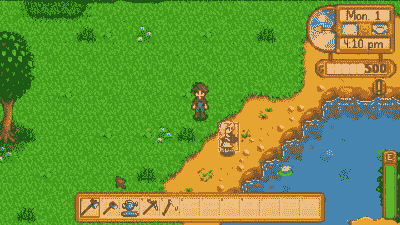

# 星谷偏好机器人是给玩家的礼物

> 原文：<https://hackaday.com/2021/11/14/stardew-valley-preferences-bot-is-a-gift-to-the-player/>

似乎大多数叙事游戏都有某种内置的苦差事。你知道，如果你想成功，你必须做一些单调乏味和重复的工作。在*星谷*里，那件事就是送礼，就像在现实生活中一样为你赢得友谊积分。比送礼本身更重要的是，每个村民都有偏好——他们喜欢、喜欢、不喜欢收到的礼物。要记住的东西太多了，大多数人都懒得去尝试，只是在维基中查找。好吧，除了阿比盖尔，她似乎非常喜欢某些宝石，她一定在吃它们。她很难忘记。

 [【库特鲁汉 _ 阿克塔尔】的村民礼物偏好 bot](https://hackaday.io/project/182500-stardew-valley-villager-gift-preferences-bot/details) 是对 OpenCV 的一次有趣而奇幻的使用。这个机器人使用 LattePanda Alpha 864s，这是一台内置 Arduino Leonardo 的单板计算机。它使用模板匹配来工作，这基本上是一个*沃尔多在哪里的游戏。*用于电脑。

给定每个村民在不同位置的截图，LattePanda 在给定的游戏场景中识别他们，然后查找他们的生日和偏好，莱昂纳多将这些打印在 3.5 英寸的 LCD 屏幕上。同时，它会用蜂鸣声和绿色大 LED 灯提醒玩家。请务必在休息后查看它的运行情况。

在*动物穿越*中，苦差事相当于在捕捉流星时按下 A 键。[对于一个十几岁的孩子来说，这不是什么大问题。](https://hackaday.com/2021/03/08/arduino-micro-pushes-animal-crossings-buttons/)

 [https://www.youtube.com/embed/yFy5ussf1AA?version=3&rel=1&showsearch=0&showinfo=1&iv_load_policy=1&fs=1&hl=en-US&autohide=2&wmode=transparent](https://www.youtube.com/embed/yFy5ussf1AA?version=3&rel=1&showsearch=0&showinfo=1&iv_load_policy=1&fs=1&hl=en-US&autohide=2&wmode=transparent)

