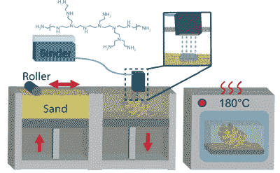

# 聚合物的发现赋予 3D 打印沙子超强的强度

> 原文：<https://hackaday.com/2021/11/21/polymer-discovery-gives-3d-printed-sand-super-strength/>

3D 打印的研究活动似乎永远不会结束，几乎每天都有新技术和旧技术的改进不断见诸报端。这一次，重点是一项我们没有涉及太多的技术，即粘合剂喷射添加制造(简称 BJAM，朗朗上口吧？)特别是来自橡树岭国家实验室的团队，他们一直在探索使用所谓的[超支化聚乙烯亚胺(PEI)作为粘合剂，喷射到普通的旧铸造硅砂上](https://www.nature.com/articles/s41467-021-25463-0)(《自然》，免费获取。)

Roll, spray, bake. Simples.

将 PEI 粘合剂与水和 1-丙醇的 75∶25 混合物(不与 2-丙醇即异丙醇混合)混合，以获得用于用压电打印头喷射的正确粘度和允许足够粉末床渗透的正确表面张力，从而给出最佳粘合效率。该团队报告说，与以前的喷射技术相比，强度增加了两倍，然而，真正的新闻是他们接下来做了什么；通过向印刷部分(称为绿色部分)注入普通的旧氰基丙烯酸乙酯(ECA，对我们来说是强力胶)，由于粘合剂和 ECA 渗透物之间的反应，印刷品的结构强度进一步增加了八倍。

为了进一步发挥 PEI 粘合剂/ECA 混合物的优点，它证明是水溶性的，至少在几天内是水溶性的，因此可以用于制造复杂形式的冲洗工具——可以被冲走的内部支撑。几天后，固化过程完成，产生的结构据说比混凝土更坚固。用碳纤维加固它，好家伙，你有一种坚韧的建筑材料！

对于一些非常普通的材料和简单的印刷过程来说，这已经不错了。

不久前我们报道了一个类似的使用锯屑的粘合剂喷射过程，以及一个用金属粉末打印的简洁方法[，将它放在氩气流中并用激光烹饪](https://hackaday.com/2018/09/17/3d-printing-in-metal-the-laser-and-metal-powder-printers-we-saw-at-imts/)，但是有一个 DIY 努力加入粘合剂喷射游戏的机会。

谢谢[Victor]的提示！