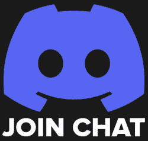
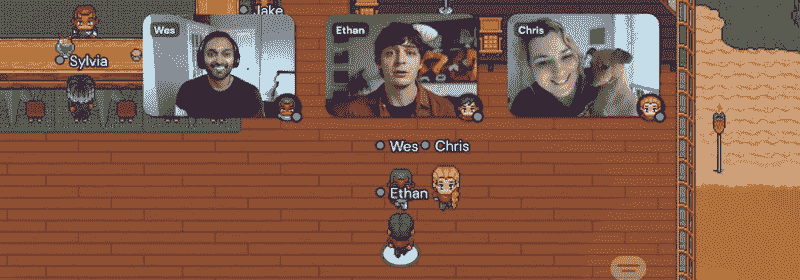

# 星期五:与不和谐和带来一个黑客的社会

> 原文：<https://hackaday.com/2021/11/17/friday-getting-social-with-discord-and-bring-a-hack/>

距离 [2021 Hackaday Remoticon](https://remoticon.io/) 的开幕只有几天了，我们仍在幕后疯狂地工作，以将尽可能多的内容打包到两天的虚拟活动中。事实上，有太多的事情正在进行，我们认为你会喜欢在周末规划你自己的个人课程时有一点领先。这个活动可能是免费的，但是没有理由不尽你所能从中榨取更多。

## 不和谐时就聊起来

 首先，你真的打算要[加入官方黑客日 Remoticon Discord 服务器](https://discord.gg/NkbHrAW7NG)。我们知道黑客时代的一些读者宁愿我们使用矩阵，或 IRC，或可能仔细调制的烟雾信号；但在一天结束时，不和谐已经成为这种事情的事实选择。试试看，你可能真的会喜欢它。

Discord 服务器不仅仅是志同道合的黑客们在周六聚会后讨论 DJ Jackalope 的音乐风格的地方。这也是与会者在每位演讲者演讲结束时提问的方式，因为我们将关闭 YouTube 聊天以保持事情的集中。即使你不打算与他人交流(虽然你真的应该这样做)，Discord 服务器也有一个互动的活动时间表，可以让你注册，以便在你选择的讲座即将开始时得到通知，随着活动的进行，我们会在那里发布重要的公告和链接。

## 聚集镇的周五聚会

Like this, but with soldering irons.

周五晚上以一场展示结束，与会者可以展示他们使用 Gather 开发的任何东西。这是一个虚拟 2D 世界中的视频聊天平台，看起来有点像*塞尔达传说。*

使用这种虚拟环境，你只需走到演示者面前，就可以轻松地进入正在播放的视频流。一旦你看够了，就走到下一个用户群。重点是重现在一个拥挤的聚会后停下来的体验，每个人都带着一些硬件项目来进行火花对话。空间将是有限的，持票人和不和谐的人将获得第一个名额，所以请留意您的收件箱，了解如何加入。

当然，这不是唯一的周五晚上的活动。几周前，我们宣布[勒温日将举办黑客琐事](https://hackaday.com/2021/11/01/shall-we-play-a-game/)，给我们亲爱的评论者一个展示你无可挑剔的技术知识和黑客历史的机会。周五的谈话流将立即转储到琐事，但[这里有专门的链接](https://youtu.be/uRpUdQi31tg)如果你想为自己设置一个提醒。

## 试试吧，你会喜欢的！

很难，甚至不可能真正重现亲临黑客大会的体验。但有了互动活动和最新最棒的通信软件，我们希望 2021 年的远程会议能非常接近。所有的部分都已就位，我们现在唯一需要的是有一大群兴奋的黑客加入进来，玩得开心。你能帮我们吗？