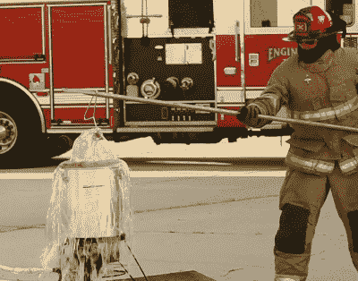
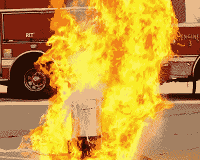

# 为什么油炸火鸡会出错

> 原文：<https://hackaday.com/2021/11/24/why-deep-frying-turkey-can-go-very-wrong/>

明天是感恩节，这意味着全美国的美国人都将烹制火鸡大餐。烹饪这种鸟最流行的方法之一是在油中油炸。

各地的地方电视台本周都在警告人们不要油炸火鸡。他们没有错……如果事情失去控制，你可能会烧掉你的房子，甚至整条街。让我们来谈谈 11 月火鸡火灾背后的科学，并希望避免火鸡费尔诺。

## 简单错误

油炸火鸡的典型方法是将火鸡放入一个放在煤气灶上的装满油的大锅里。绳子和滑轮通常被用来将火鸡放入锅中，以避免手接触热油。理想情况下，这应该在后院进行，远离建筑物，以提供良好的通风和足够的空间，以防出现问题。

 [https://www.youtube.com/embed/TcPiLtFuscA?version=3&rel=1&showsearch=0&showinfo=1&iv_load_policy=1&fs=1&hl=en-US&autohide=2&wmode=transparent](https://www.youtube.com/embed/TcPiLtFuscA?version=3&rel=1&showsearch=0&showinfo=1&iv_load_policy=1&fs=1&hl=en-US&autohide=2&wmode=transparent)

Overfilling the deep fryer is a great way to start a big fire on Thanksgiving. Credit: [Ogden Fire Department](https://www.youtube.com/watch?v=TcPiLtFuscA)

这一切听起来相当直截了当，但有两种方式经常出错，导致跳跃的火焰和呼叫消防部门。首先很简单:过量灌装。将火鸡放入油中，必然会排出油。因此，当火鸡进入锅内时，满到边缘的锅就会溢出，热油顺着烹饪容器的侧面直接流向下面的煤气灶。这是初学者的错误，但也是经常发生的错误。为了避免这种情况，在把火鸡放进锅里之前，重要的是要计算好火鸡的体积，以避免引发火灾。

火鸡火灾的第二个主要原因是试图油炸冷冻火鸡。冷冻火鸡上的冰与热油接触时会迅速变成蒸汽。蒸汽迅速膨胀，产生气泡，并迅速将热泡沫油撒得到处都是。这本身很容易导致严重烧伤，但煤气灶的存在只会增加危险。热的雾化油通常会着火，或者来自燃烧器本身，或者只是附近的热表面，并迅速产生一个巨大的火球。

Oil can be seen flying out of the pot thanks to the steam generated by the frozen turkey. Credit: [Ogden Fire Department](https://www.youtube.com/watch?v=TcPiLtFuscA)

这类似于熔融铝与水反应不良，导致[危险的铸造爆炸，](https://hackaday.com/2020/12/30/water-and-molten-aluminium-is-a-dangerous-combination/)尽管没有铝案例中发生的化学反应。一个简单的事实是，让过量的冰或水接触到 212 华氏度以上的热液体往往会导致灾难。

值得庆幸的是，通过适当的前瞻性规划，这些问题同样很容易避免。第一步是适当解冻火鸡，通常每 5 磅肉至少需要在冰箱中解冻 24 小时。检查火鸡的内外是否有冰晶，以确保它完全解冻。

然后，可以使用水作为检查正确油位的简单方法。将火鸡放入煎锅中，然后将容器注满水至安全水位。取出火鸡，注意锅里剩余的水位。这是你必须在锅里放多少油。

将油保持在华氏 350 度或以下，可以减少着火的可能性，也可以避免火鸡被难闻的烧焦的油味污染。此外，很少有人想到的一个好方法是在将火鸡放入油中之前关掉煤气灶。这样，如果发生泄漏或其他事故，石油就更有可能不会着火。一旦火鸡被安全地放入油炸锅，再把它点燃就很简单了。

在手边准备一个适用于烹饪油和脂肪的灭火器也是有好处的。湿化学灭火器对这些火灾最有效。在这种情况下，灭火毯也很有用。此外，如果你选择好了你的位置，并且你没有在车库里、院子里或木制甲板上油炸，那么就不太可能发生任何失控的事件。

避免滚烫的油喷到你的客人和后院经常被认为是享受假期的关键，不仅仅是感恩节。因此，有了这些知识和我们今天讨论的技巧，你应该准备好在感恩节油炸你的火鸡，以绝对最小的人身伤害和财产损失。好好吃饭，在外面玩得开心！

附言:马上解冻！别等了！