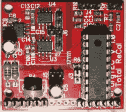

# 视力受损的电子工程师展示完成工作的方法

> 原文：<https://hackaday.com/2021/11/26/vision-impaired-electronics-engineer-shows-the-way-to-get-things-done/>

随着普通电子爱好者年龄的增长，一件有趣的事情发生了:他们的眼睛——它们不再像以前那样工作了。但是如果你的生活是从视力受损开始的呢？在这个[史诗论坛帖子](https://www-elektroda-pl.translate.goog/rtvforum/topic3814473.html?_x_tr_sl=pl&_x_tr_tl=en&_x_tr_hl=pl&_x_tr_pto=nui#)(谷歌从波兰语翻译成英语)中，我们遇到了几近失明的黑客【Urgon】。他详细讲述了自己的状况，以及这种状况不仅影响了他的日常生活，还影响了他作为电子工程师的能力。或者反过来说，它怎么*不*。

[乌尔贡]的起源故事很熟悉。八岁时，他拆卸了他的第一台电视机。他继续自学，利用他仅存的视力吸收他能得到的每一点有关电子的文献。一位好心但保护他的母亲让他远离烙铁，担心离他的好眼睛太近可能对他剩余的视力不是好兆头。

If Urgon can solder SOIC’s 0805’s, so can you!

尽管一只眼睛失明，另一只患有严重的青光眼，但[Urgon]坚持了下来。正如你所料，他使用辅助技术，但他指出，最近一些优秀的免费软件已经超过了他过去使用的一些商业产品。

虽然我们当中即使有视力的人也经常回避 SMD 元件，但[Urgon]却一头扎了进去。SOIC 包裹和 0805 零件并没有阻止他。明亮的 LED 手电筒，用他的智能手机放大，再加上一定的耐心，使得他的黑客生涯成为可能。

这并不是说[乌尔贡]没有一些值得注意的事件。他曾被 ATX PSU 中的 400 V 电容器电击过，被烙铁烫伤过脸，甚至还踩到过 DIP 封装。赤脚。是的，针朝上。

但是等等，还有更多！[在这篇后续文章](https://www-elektroda-pl.translate.goog/rtvforum/topic3829724.html?_x_tr_sl=pl&_x_tr_tl=en&_x_tr_hl=pl&_x_tr_pto=nui)中，【Urgon】讨论了更多的辅助/适应性技术，以及像你我这样的黑客如何将我们的努力集中在对视力受损者最有帮助的事情上。

我们向[乌尔贡]以及像他这样不顾困难坚持不懈的人致敬。我们都可以学习[Urgon]的黑客精神和他对这个行业的奉献。我们最近报道了一些盲目的软件黑客，他们擅自驾驶客机，当然是虚拟的！

感谢[Moryc]的精彩提示！