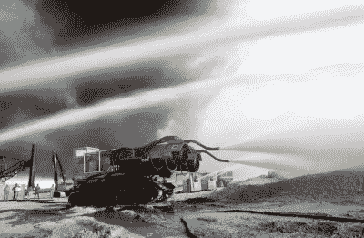
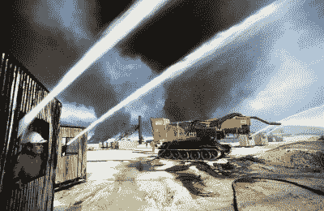

# 大风是你见过的最卑鄙的消防坦克

> 原文：<https://hackaday.com/2021/12/06/big-wind-is-the-meanest-firefighting-tank-you-ever-saw/>

随着伊拉克军队在第一次海湾战争结束时撤退，他们对“焦土政策”一词的理解相当准确。科威特油井被集体点燃，形成高耸的地狱，染黑了天空。

事实证明，扑灭一口燃烧的油井绝非易事。然而，在这场环境灾难面前，一支来自匈牙利的消防队在沙漠中扬名立万，他们骑着一辆名为*大风*的喷气式坦克。

## 绝对的权力

 [https://www.youtube.com/embed/ppwWJYNUMCM?version=3&rel=1&showsearch=0&showinfo=1&iv_load_policy=1&fs=1&hl=en-US&autohide=2&wmode=transparent](https://www.youtube.com/embed/ppwWJYNUMCM?version=3&rel=1&showsearch=0&showinfo=1&iv_load_policy=1&fs=1&hl=en-US&autohide=2&wmode=transparent)

大风并不是第一种，而是苏联首创的一种概念的成功发展。几十年前，苏联曾试验在 ZIL-131 卡车后面安装米格-15 喷气发动机。一对喷水嘴被栓在喷气口的正上方，强大的水流和空气可以用来有效地扑灭大火。这个想法在匈牙利石油行业变得流行起来，特别是在 1968 年[被用来扑灭 168 Algyo 油井的大火](https://www.delmagyar.hu/szeged-es-kornyeke/idoutazas-a-delmagyarral-kitort-a-168-as-algyoi-olajkut-4171141/)之后。

Big Wind on the ground in Kuwait, extinguishing a burning oil well. Credit: Getty Images

几十年后的 1991 年，石油公司 MB Drilling 在布达佩斯东南约 50 英里的一个小镇上对自己设计的高级版本进行最后的润色。被称为“大风号”的“大风号”是在二战时期俄罗斯 T-34 坦克的底盘上建造的。代替原来的炮塔，它配备了一对 Tumansky R-25 涡轮喷气发动机，用于米格-21 战斗机，产生 27，000 磅的推力。每个引擎都装有三个喷水嘴，每秒钟能喷出 220 加仑的水。它是在科威特急于扑灭数百口燃烧的油井时完成的，因此通过空中运输迅速部署到该国。

其灭火能力背后的机制很简单。从井口喷出的石油是在压力下喷出的，主火焰距离地面有 15-30 英尺。水和空气的强烈爆炸有助于切断火焰的石油供应，同时也有助于从大气和周围地区吸收大量的热量。随着燃烧的油井周围的空气温度达到 650 华氏度，下面的沙子加热到 1300 华氏度，这也不足以简单地扑灭大火。*大风*将在灭火后持续喷射整整 20 分钟，确保石油不会在溅落到灼热的地面上时自燃。

操作这台机器绝非易事。三名船员操作 *Big Wind，*一名司机坐在机器的前部，负责以每小时 3 英里的最高速度向火场爬行，选择这样做是为了避免损坏上面相对脆弱的喷气发动机平台。在后方，另一名操作员负责控制喷气发动机和喷水嘴。第三名成员走在离坦克大约 15 英尺的旁边，通过一组有线控制向其他人发出命令。船员们都穿着防火服来保护自己免受高温的伤害，并戴上手套来避免在距离火焰 40 英尺的范围内被坦克的控制器烫伤。

这次行动的水源来自阿拉伯湾，盐水通过反向运行的输油管道泵入。水库是专门为此目的挖掘的，在巨大的柴油动力水泵的帮助下，每分钟向大风输送数千加仑的水。

Gallons of seawater were pumped into reservoirs to feed fire fighting apparatus charged with extinguishing the well fires in Kuwait. Credit: Getty Images

在车内，司机通过 LED 箭头接收来自外部的命令，这些箭头会亮起，指示消防队长想要的行进方向。类似的方法用于指示后方操作者何时启动喷嘴和水。每个船员也有一个安全开关系统，他们必须定期确认，以表明他们在行动中的安全。

在消防队长的命令下，机器被定位在离燃烧的油井 25 英尺的地方，R-25 喷气发动机在地面上以最大 70%的安全油门点火。然后，喷水嘴启动，燃烧的油井迅速熄灭。一旦被扑灭，该区域用大量额外的水冷却 20 分钟，*大风*随后被逆转出该区域，覆盖受损油井的艰难工作可以开始。

## 他们现在在哪里？

在最初的形式中，大风扑灭了科威特九口燃烧的油井，超过了许多使用烈性炸药扑灭油井大火的队伍。这辆坦克是在 IMAX 电影*科威特之火*中拍摄的，雷普·汤恩讲述了匈牙利船员与大火搏斗的过程。

然而，这些天来，这种机器在一种更现代的 VT-55 恢复车辆的底盘上滚动，这种车辆与后来的 T-55 坦克共享其平台。该车在工作多年后被封存，存放在托科尔机场，直到 2013 年左右，然后被匈牙利石油公司 MOL Group [重新启用，再次承担其最初的目的。](https://www.youtube.com/watch?v=ppwWJYNUMCM)

用大型喷气式发动机灭火的做法还没有真正广泛流行起来。它对任何城市都没用，因为强大的爆炸会造成过度的破坏和伤害。在匈牙利石油亚文化之外，这种做法在很大程度上被那些更熟悉爆炸技术或用传统泵和软管简单应用数吨水的人所忽视。无论如何，*大风*仍然是有史以来最令人印象深刻的消防机械之一，这个头衔在未来一段时间内可能不会受到挑战。